# CityTour

> HackYeah 2026 · Huawei challenge "Imagine What's Next" · native ArkTS/ArkUI app for HarmonyOS / OpenHarmony (API 20+)

**Status: work in progress (built during HackYeah 2026, 3–4 Oct 2026).**

CityTour is a mobile tour guide that follows you through the city. It tracks where you are and which way you are walking. When you reach a place of historic or cultural significance, it explains that place to you.

**The app ships no built-in course.** On first start Home says "Pick a walk to start": a course can be streamed (**Play now**) or downloaded; the Kraków course (pack + 1155 studio-voice clips, ~40 MB, 1167 signed files) is downloaded once from the course server ([`server/`](server/README.md), deployed at `https://citytour-server.onrender.com`). After that everything works offline: the downloaded pack, the downloaded clips, and the built-in voice only as the last resort. See [Courses](#courses-and-online-voice).

Project scope and decisions are recorded in [`HACKATHON_BRIEF.md`](HACKATHON_BRIEF.md).

## Challenge area

**Spatial Experiences** (lead), with Human-Centric Technology (cultural experiences) as the secondary area. Recorded in `HACKATHON_BRIEF.md`.

## Platform capabilities used

_Updated as each capability lands. Every entry links to the code that uses it._

| Capability | Kit / API | Where | Status |
| --- | --- | --- | --- |
| — | — | — | planned |
| Next-stop notification (glanceable with the screen off; text-only arrival line) | Notification Kit `notificationManager` (`requestEnableNotification`, `publish` id 1001 `isAlertOnce` SERVICE_INFORMATION slot, `cancel`) | [`services/notify/TourNotifier.ets`](entry/src/main/ets/services/notify/TourNotifier.ets), text rules in [`core/notify/NotifyText.ets`](common/src/main/ets/core/notify/NotifyText.ets) | verified on emulator (sdk24) |
| Pre-rendered stop-story clips (studio voice, offline once downloaded) with native-TTS fallback per sentence | Media Kit `AVPlayer` (`url = fd://` of the downloaded sandbox file, `STREAM_USAGE_AUDIOBOOK`) | [`services/audio/ClipPlayer.ets`](entry/src/main/ets/services/audio/ClipPlayer.ets), selection in [`core/speech/ClipSelection.ets`](common/src/main/ets/core/speech/ClipSelection.ets), used by [`services/speech/NarrationPlayer.ets`](entry/src/main/ets/services/speech/NarrationPlayer.ets) | **489 clips ship** (Historian, teaser + full, en/pl/zh, 22.4 MB, voice "George", `eleven_multilingual_v2`). A tour whose story language has clips runs on them (`NARR_AUDIO event=story_voice clips=yes`, then `src=prerendered reason=hash_match` per sentence); deep stories and dynamic lines stay native TTS (en/zh) or text (pl). Unit-tested; emulator run of the phase 2 tour path not yet verified |
| Downloadable courses (the only source of a course) | Network Kit `http` (timeouts + overall deadline per call; `ohos.permission.INTERNET`), Crypto Architecture Kit Ed25519 `createVerify` over the signed catalog/manifest, async SHA-256 `createMd` per blob, Core File Kit `fileIo` (temp folder + one atomic `rename`), TaskPool (clip manifest parse) | [`services/remote/`](entry/src/main/ets/services/remote/), rules in [`core/remote/`](common/src/main/ets/core/remote/), UI [`pages/CoursesPage.ets`](entry/src/main/ets/pages/CoursesPage.ets) | unit-tested (canonical JSON vs the server's signed seed, course merge rules); not run against a live server yet |
| Runtime studio voice (course server) | Network Kit `http` `POST /v1/tts` (2.5 s budget), Media Kit `AVPlayer` with `fd://` sandbox files (cache `filesDir/tts/<sha>.mp3`) | [`services/speech/RemoteVoice.ets`](entry/src/main/ets/services/speech/RemoteVoice.ets), chain in [`core/remote/VoiceChain.ets`](common/src/main/ets/core/remote/VoiceChain.ets) | unit-tested decision chain; on-device playback unverified |
| Home-screen "Next stop" card (2×2): next stop, distance, progress, SIMULATED pill; tap opens the app | Form Kit: `FormExtensionAbility` + ArkTS card, `formProvider.getPublishedRunningFormInfos` (API 20) + `updateForm`, `postCardAction` router | [`formability/EntryFormAbility.ets`](entry/src/main/ets/formability/EntryFormAbility.ets), [`widget/pages/NextStopCard.ets`](entry/src/main/ets/widget/pages/NextStopCard.ets), push logic [`viewmodel/WidgetBridge.ets`](entry/src/main/ets/viewmodel/WidgetBridge.ets) + [`core/widget/CardModel.ets`](common/src/main/ets/core/widget/CardModel.ets) | verified on emulator: added from the launcher, updated live during the Demo walk (`WIDGET event=push forms=1 mode=heading ...`), [screenshot](docs/img/widget-active.png) |
| Arrival haptic | Sensor Service Kit `vibrator` (`isSupportEffectSync` preset, timed fallback; `ohos.permission.VIBRATE`) | [`services/haptics/Haptics.ets`](entry/src/main/ets/services/haptics/Haptics.ets) | called and logged; the emulator has no motor (`14600101`, logged, no crash) |

## Mocked or simulated behavior

_Every simulated input is labelled in the app UI and listed here._

- **Demo walk (simulated location).** Offered for any active course whose downloaded pack ships a demo track (`demo-walk.json`, part of the signed course manifest; the HAP contains no course content and no city at all). Replays a recorded walk along the course's route through the same pipeline instead of GPS. The tracks are generated by `scripts/demo/make-demo-walk.mjs` (`--course <id>`) along each pack's own legs in the planner's order; the Royal Route (`krakow`) track adds one deliberate ~80 m detour off Grodzka (it triggers the off-route warning and a re-plan), a pass-by stop and 10 s of 60 m accuracy; the `krakow-scholars` and `krakow-kazimierz` tracks start at the first stop and dwell at every stop. Switch it in **Settings › Demo › Demo walk (simulated location)** (replay speed 1×/2×/4×/8×, persisted), or one tap with **Try a demo walk** on Home (8×). Every walking surface shows the amber **SIMULATED** pill; logs say `LOC_SOURCE kind=demo simulated=true`.
- **Tour summary time for the Demo walk.** After a tour, the summary (B11) shows stops heard, distance walked and total time. "Walked" is the route length along the pack's legs from the first stop to the last stop heard (the engine's own GPS distance also adds up position jitter while standing at stops, so it isn't used; it is still logged as `engineWalkedM`). On real GPS the total is the elapsed time. For the Demo walk (replayed at up to 8×) it is a *walking-pace* time: walked metres at the engine's 1.3 m/s plus the real time spent at stops. The summary shows the amber **SIMULATED** pill and "Simulated walk: distances and times come from a recorded route."; the log line is `TOUR_SUMMARY ... time=walking_pace src=demo`.

## Languages

The UI is available in English, Polish and Simplified Chinese (`entry/src/main/resources/{en_US,pl_PL,zh_CN}/element/string.json`; `base` is English). By default it follows the system language. You can also choose it in **Settings › App language** (`i18n.System.setAppPreferredLanguage`). For any other system language the app uses English.

The Polish and Chinese UI strings were **machine-drafted by an AI agent** from the English, starting from the key-string drafts in `docs/DESIGN.md` §3.17. **They have not yet been checked by a native speaker.**

`scripts/pack/strings.test.mjs` runs as part of `scripts/test.sh`. It fails if a locale is missing a key, has an extra one, or changes a value's `%s`/`%d` placeholders.

Story languages are separate from the UI language. They come from the downloaded course pack: see [Data pipeline](#data-pipeline).

## Screenshots

Taken on the Pura 90 emulator (API 24 image, `devecocli ui screenshot`). The amber **SIMULATED** pill marks the Demo walk.

| Home | Tour detail | Route ready |
|---|---|---|
| 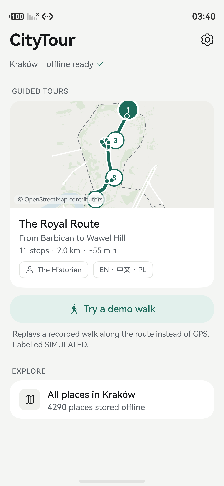 | 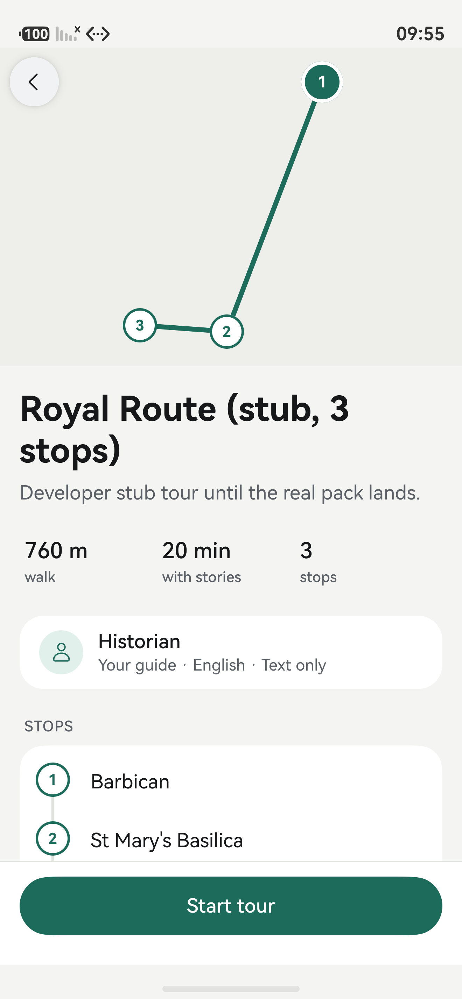 | 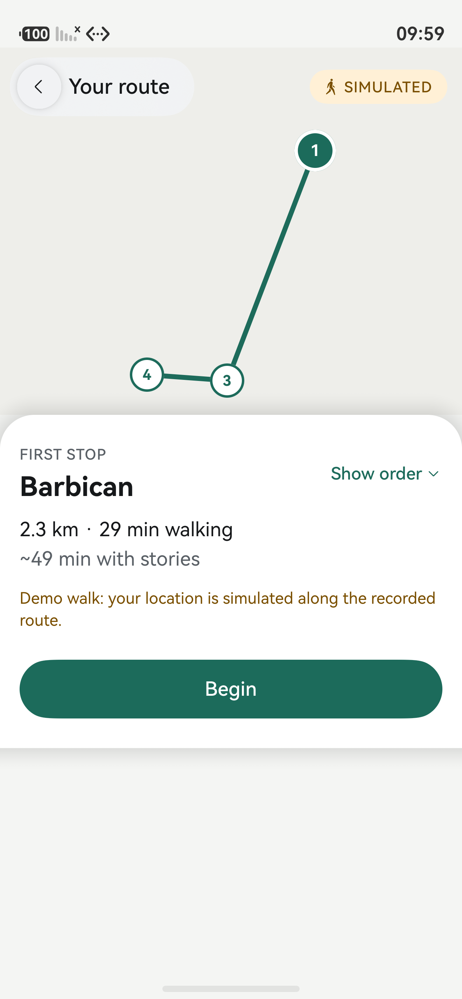 |

| Now Walking (heading) | Now Walking (at a stop) | Place detail |
|---|---|---|
| 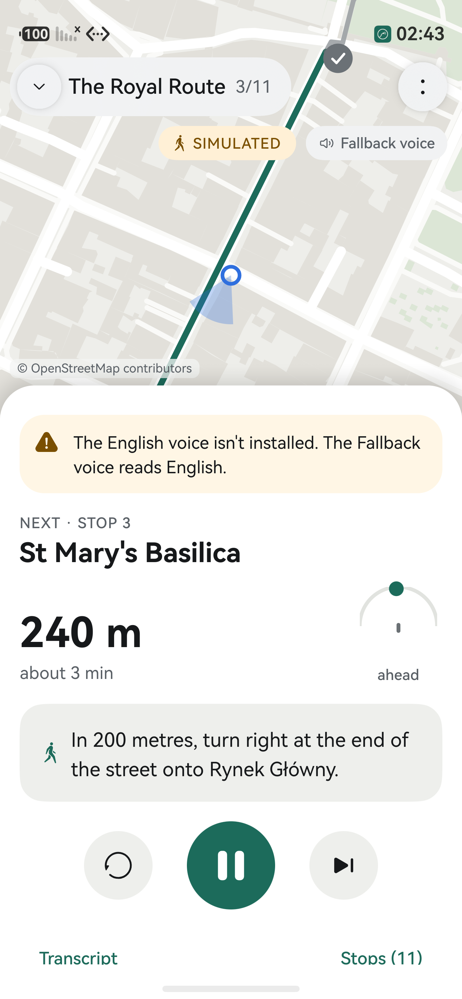 | 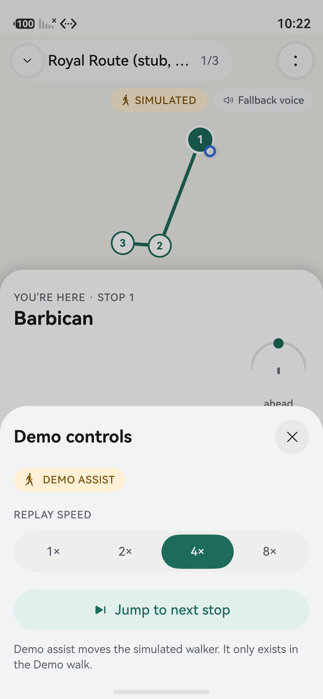 | 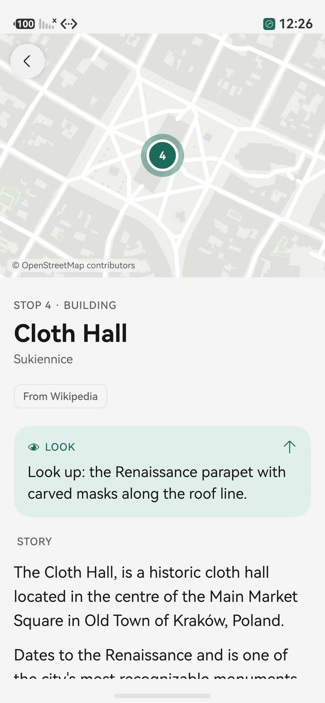 |

| Lock screen (AVSession) | Settings | About & licences |
|---|---|---|
| 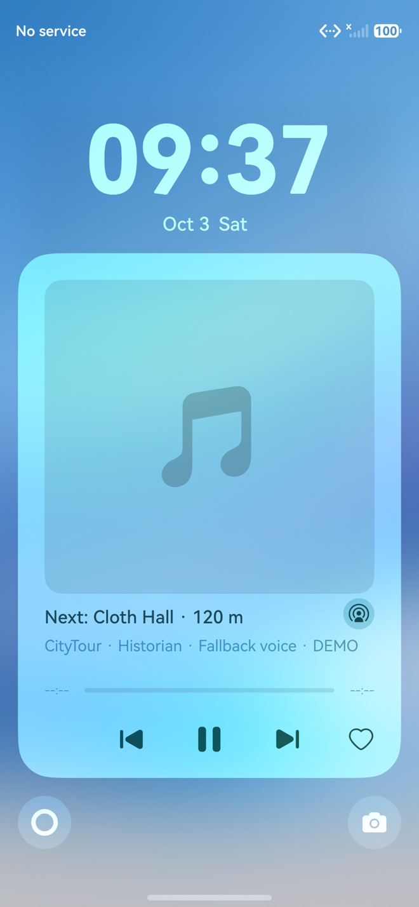 | 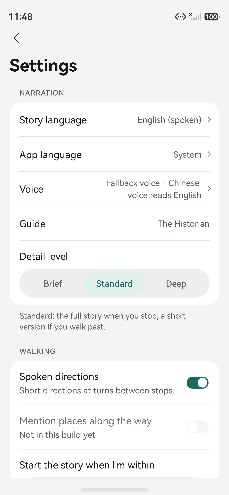 | 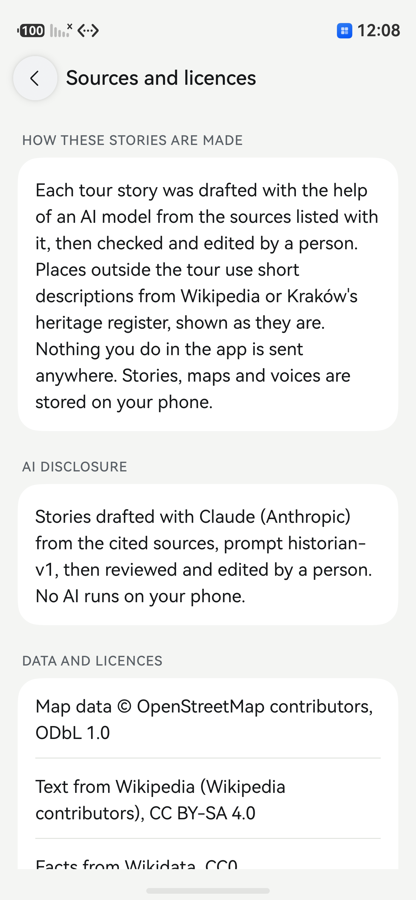 |

| All places (explore map) | Place card |
|---|---|
| 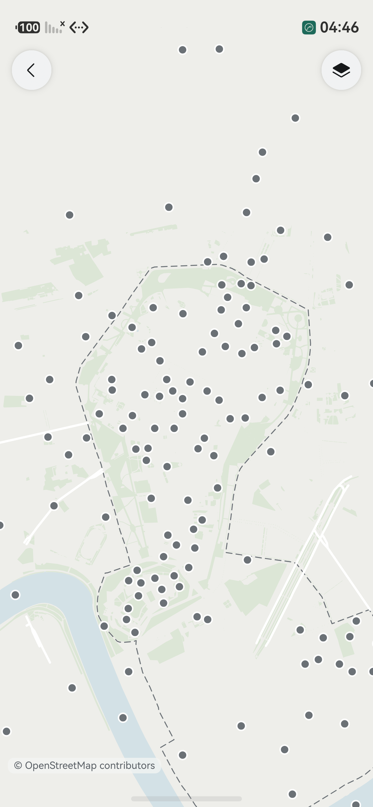 | 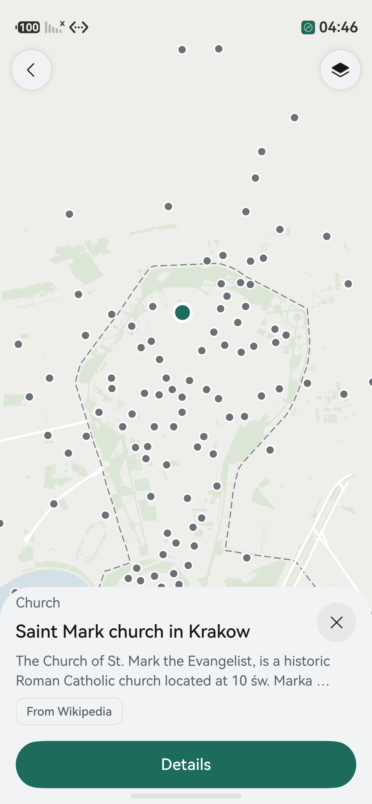 |

| Polish UI | Chinese UI |
|---|---|
| 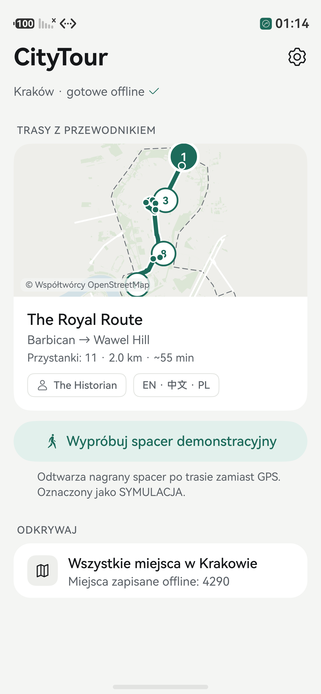 | 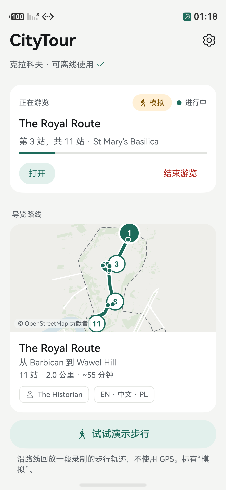 |

| Tour complete (Demo walk) | Tour ended early |
|---|---|
| 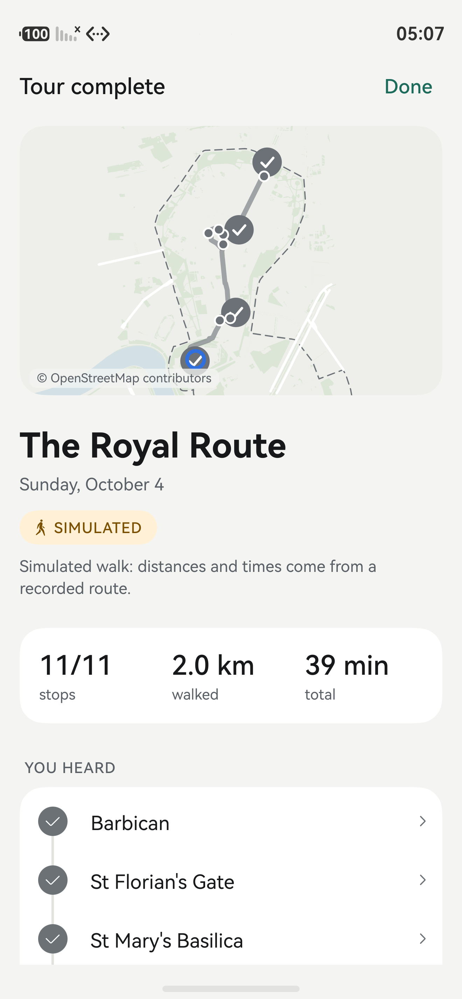 | 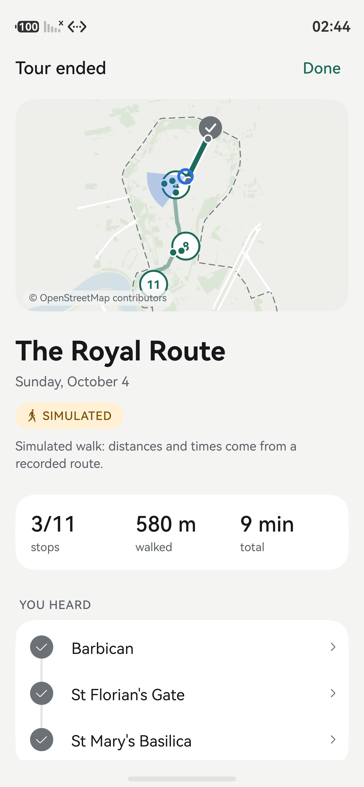 |

## Data sources and licences

All data is fetched once at build time, committed under [`data/raw/`](data/raw/) and compiled into the Kraków course pack (see [Data pipeline](#data-pipeline)), which the app downloads once from the course server; after that it makes no network call for content. Full provenance (endpoints, queries, retrieval times, record counts, what each layer contains) is in [`data/raw/SOURCES.md`](data/raw/SOURCES.md); per-source records ship in the course pack as [`sources.json`](data/course/krakow/packs/krakow/sources.json), and the app shows them in **Settings › About › Sources and licences** and per place in **Place detail › Sources**.

| Source | Used for | Retrieved | Licence |
|---|---|---|---|
| [Wikidata](https://www.wikidata.org) (SPARQL, items located in Kraków) | 4,290 places: coordinates, names en/pl/zh, type, heritage status, dating | 2026-10-03 | CC0 1.0 |
| [Wikipedia](https://www.wikipedia.org) en / pl / zh (REST summaries, article extracts) | Place summaries (218 en, 297 pl, 71 zh) and the source text of the 11 tour stories | 2026-10-03 | CC BY-SA 4.0 (attributed per text in the app) |
| [OpenStreetMap](https://www.openstreetmap.org/copyright) (API 0.6, Old Town tiles) | Offline vector map (streets, buildings, water, green) | 2026-10-03 | ODbL 1.0, "© OpenStreetMap contributors" shown on every map |
| [OSRM](https://routing.openstreetmap.de) foot profile (FOSSGIS server) | 110 walking legs between the tour stops (distances, times, turn-by-turn steps) | 2026-10-03 | ODbL 1.0 (derived from OSM) |
| City of Kraków ArcGIS (Zintegrowana Platforma GIS: heritage register, UNESCO zone) | Register facts and the UNESCO World Heritage outline | 2026-10-03 | **Unverified**: no published terms; used for coordinates and register facts only, cited with service URL and date ([docs/RISKS.md](docs/RISKS.md) T14) |
| [Wikimedia Commons](https://commons.wikimedia.org) (one photo per course: Wawel, Collegium Maius courtyard, Old Synagogue) | Tour cover photos on Home, Courses and Tour detail (real photographs, cropped to 16:10 and resized; credit shown on the photo and in About) | 2026-10-03 | CC BY-SA 4.0, authors and source pages in [`data/ATTRIBUTION.md`](data/ATTRIBUTION.md) |
| ElevenLabs (`eleven_multilingual_v2`, voice "George") | Pre-rendered studio-voice clips of the stories and fixed lines | build time | AI-generated audio, see [`data/ATTRIBUTION.md`](data/ATTRIBUTION.md) |

Narration tiers in the pack (from [`validation-report.json`](data/course/krakow/packs/krakow/validation-report.json)): every place has a teaser in en/pl/zh. 25 per language are **grounded-AI** Historian scripts for the 11 tour stops (drafted by Claude from the cited Wikipedia text; disclosed in Settings › About › Credits and licences and in the presentation, not on the story screens); the rest are verbatim Wikipedia extracts or a name-only template. All 12,912 narrations pass the validator.

## Known limitations

- **One city, one tour.** The pack covers Kraków (4,290 places on the map data, the Old Town map); there is one guided tour, the Royal Route (11 stops).
- **The emulator cannot move.** Its GPS is a fixed point and can't be driven from the command line, so tours on the emulator use the SIMULATED Demo walk. The real Location Kit path is wired in and selectable in Settings.
- **Voices on the emulator.** The emulator has no English or Polish system voice: English is read by the Chinese voice, and Polish lines without a studio clip are shown as text. Stories with studio clips play in all three languages.
- **AI-drafted content, not yet reviewed.** The Historian stories (English, then machine-translated to Polish and Chinese) and the Polish and Chinese UI strings were drafted by AI and have not been checked by a historian or native speakers. This is disclosed in Settings › About › Credits and licences and in the presentation; the everyday screens carry no provenance labels (user decision).
- **Sparse Chinese sources.** Only 71 places have a Chinese Wikipedia summary; most Chinese place texts are the name-only template.
- **Basic explore map.** Home › "All places in Kraków" opens the full map with every place as a dot (places with a sourced story from the overview zoom, name-only places as you zoom in, crowded dots thinned). The DESIGN §3.7 filter chips, count clusters and the card's Listen button are not built yet.
- **Kraków ArcGIS licence unverified** (see the table above).
- **No vibration on the emulator.** Arrival haptics are called and logged, but the emulator has no motor (`14600101`, no crash).

## Requirements (tested versions)

| Tool | Version |
| --- | --- |
| macOS | 15.1 on Apple Silicon (M3). The DevEco emulator requires Apple Silicon. |
| DevEco Studio | 6.1.1.280 (Mac ARM) |
| HarmonyOS SDK | bundled with DevEco Studio 6.1.1 (API 24) |
| Emulator | DevEco Emulator 6.1.1.200, image HarmonyOS 6.1.1(24) phone, software version 6.1.0.126, device "Pura 90" |
| DevEco CLI | `@deveco/deveco-cli` 1.3.4, patched with the challenge repo's `scripts/apply-devecocli-patches.mjs` |
| Node.js | 22 or later (developed with 24.x) |

API levels in `build-profile.json5`: `compatibleSdkVersion` **6.0.0(20)** (challenge minimum), `compileSdkVersion` / `targetSdkVersion` **6.1.1(24)**.

## Setup from a clean machine

1. Install **DevEco Studio** for Mac ARM from https://developer.huawei.com/consumer/en/download/. Launch it once to finish the first-run setup, then quit it.
2. **Switch the DevEco region to China.** Outside China the emulator only offers watch images. Edit `~/Library/Application Support/Huawei/DevEcoStudio6.1/options/country.region.xml` and set `<countryregion name="CN"/>`. See the [challenge FAQ](https://github.com/onirodeveloper/hackyeah2026-challenge/blob/main/FAQ.md).
3. Restart DevEco Studio. Go to **Tools → Device Manager → New Emulator → Phone**, choose the newest image (API 24) and download it.
4. Install the DevEco CLI and apply the challenge patches:
   ```bash
   git clone https://github.com/onirodeveloper/hackyeah2026-challenge ~/oni
   npm i -g @deveco/deveco-cli@1.3.4
   node ~/oni/scripts/apply-devecocli-patches.mjs
   ```

## Build, install and launch

```bash
devecocli emulator list                 # find your phone emulator
devecocli emulator start "Pura 90"      # or the name of your phone emulator
devecocli run --module entry --device "Pura 90"   # builds the phone .hap, installs it and launches EntryAbility
```

`devecocli run` ends with `Smoke: PASS` once the app has started on the device. The project has two entry modules (`entry` for the phone, `wearable` for the watch), so `--module` is required. To build without deploying:

```bash
devecocli build
```

The debug `.hap` is written to `entry/build/default/outputs/default/`.

### Watch build (work in progress, `wearable` module)

The watch HAP (`wearable/`, deviceTypes `wearable`, same bundle) is being built step by step, see
[`docs/research/WATCH.md`](docs/research/WATCH.md). So far it only launches a placeholder screen.

```bash
devecocli emulator image download --device-type wearable --os-version "HarmonyOS 6.1.1(24)"   # ~940 MB; retry if the connection drops
devecocli emulator create --device-type wearable --os-version "HarmonyOS 6.1.1(24)" "Watch 5"
devecocli emulator start "Watch 5"
devecocli run --module wearable --device "Watch 5"   # builds wearable-default-unsigned.hap, installs, launches WatchAbility
```

Watch log lines use the app's hilog domain and the `WATCH_` prefix (`WATCH_APP_START`, `WATCH_PAGE`). The watch HAP is
written to `wearable/build/default/outputs/default/`.

### Pre-rendered stop-story voice (ElevenLabs, build time)

The app never calls ElevenLabs and ships no key. Narration voice generated with ElevenLabs (eleven_multilingual_v2, voice 'George'); scripts AI-drafted, see review status. The build-time script rendered one mp3 per sentence into `data/course/krakow/audio/` plus `audio/manifest.json` (committed; stories teaser + full and the system/arrival/nav lines, en/pl/zh, 1155 clips; deep stories have none). They are part of the downloaded course, not the HAP. At runtime a sentence plays from its clip only when the manifest's `textSha256` equals the SHA-256 of the exact sentence text (same language and persona), otherwise native TTS speaks it (`NARR_AUDIO src=prerendered|tts|text`). Without a downloaded course (or without its clips) every sentence uses native TTS or text.

How the voice is chosen (`core/speech/ClipSelection.ets`, `storyVoicePlan`):

- **Studio voice.** When the manifest has clips for the story language, the tour runs in voice mode. The voice type is not labelled on the everyday screens or the lock screen (user decision: the ElevenLabs credit is in Settings › About › Credits and licences and in the presentation). Internally the label follows what is audible: it changes when a sentence starts (`UTT_START`, logged as `NARR_AUDIO event=voice_label`), and the opt-in How it works HUD shows **Fallback voice** while the on-device voice reads a line and **Studio voice** while a clip plays.
- **System lines and directions (phase 3).** `scripts/voice/system-lines.mjs` lists every fixed sentence the engine can say for the tour besides the stories: welcome (real tour title, simulated-walk line), finish, GPS lost, "You've left the route.", "New plan: ...", arrival + look lines for every direction, and the A9 turn-by-turn cues of every pack leg ("In 10/20/30 metres, ...", "Now ..., then ..."). Rendered into the same manifest (`audio/<lang>/_<group>/`), they play by hash like story sentences, also in Polish. `entry/src/test/SystemLines.test.ets` checks every generated sentence (2271 cases) against the real ArkTS functions, text and SHA-256. Lines with a live number (approach "In about 80 metres", "Next stop: X, about 300 metres from here", bearing guidance) stay native TTS / text.
- **Polish is spoken.** Polish stories (and, once rendered, the system lines and directions) play from the clips. Lines without a clip (live-distance lines, deep stories) stay on-screen text: Core Speech Kit has no Polish voice, and no Chinese or English voice is mixed in. A Polish story only partly covered by clips is read as text from start to end (`NARR_AUDIO event=story_incomplete action=text_whole_story`).
- **English and Chinese** fall back per sentence to native TTS.
- The user's "Text only" choice and "Listen in English, read in Polish" get no clips.
- Pause, resume (from the sentence start), skip, replay, lock-screen (AVSession) controls, audio interrupts and the background continuous task use the same sentence queue for clips and TTS.

Re-rendering needs your own key (never needed to build or run the app):

```bash
node scripts/voice/render-elevenlabs.mjs --dry-run       # clips, characters and credits per language; no key needed
export ELEVENLABS_API_KEY=...  ELEVENLABS_VOICE_ID=...    # in your own shell only, never in a file in this repo
node scripts/voice/render-elevenlabs.mjs --limit 3       # smoke test: 3 clips
node scripts/voice/render-elevenlabs.mjs                 # the rest; reruns skip unchanged sentences
node scripts/voice/render-elevenlabs.mjs --dry-run --system-only   # only the system/arrival/nav lines
```

Another course: add `--course <courseId>` (e.g. `--course krakow-scholars`); it reads that course's pack and tour and writes `data/course/<courseId>/audio/` with its own `manifest.json`.

System lines are included by default (`--no-system` skips them, `--system-only` renders only them, `--system-groups system,arrival,nav`, `--nav-legs all|tour`). A run re-plans and prunes only the clips in its scope (languages x stories/system groups). After a template change in `core/content/Phrases.ets`, run `node scripts/voice/system-lines.mjs --write-golden` and re-render; `scripts/test.sh` fails while the golden is stale or the Node port differs from the ArkTS output.

Model `eleven_multilingual_v2`, mono `mp3_44100_64` by default (`--output-format mp3_22050_32` halves the size). Input is the pack's `narrations/<lang>.json`; `--narrations-dir`, `--langs`, `--lengths`, `--fixture` and `--help` change that. The pre-commit hook rejects ElevenLabs key values.

### Course server (optional, `server/`)

Course downloads and runtime studio voice for lines without a clip come from the course server ([`docs/SERVER.md`](docs/SERVER.md), Express + TypeScript, Node 22). The app ships no course, so the first run needs it once; afterwards the app works offline. The course files it serves live in [`data/course/krakow/`](data/course/krakow/) (`packs/krakow/...`, `audio/...`, exactly the signed manifest's paths). Run it locally, publish the Kraków course and smoke-test it without any ElevenLabs call:

```bash
cd server && npm ci && npm test
npm run keygen
npm run publish-course -- --course krakow --pack ../data/course/krakow/packs/krakow --audio ../data/course/krakow/audio --data ./data --seed ./seed
```

Environment, Docker, Render deploy and the smoke test: [`server/README.md`](server/README.md). After a template change in `Phrases.ets`, re-run `publish-course --seed` too (the allowed-lines set holds the exact sentences).

### Courses and online voice

The app ships **no built-in course** (product decision: a thin client, and the download flow is part of the demo). A
small server ([`docs/SERVER.md`](docs/SERVER.md), `server/`) provides:

- **Home = the city's walks, one tap to walk.** Home says **You're in Kraków** (your location is inside the city) or
  **Walks in Kraków** and lists every walk the server has for that city, one card each: cover photo, title,
  "11 stops · 2.0 km · ~55 min", languages. **Start** on the card streams the walk if it is not on the phone
  ("Preparing…" on the card), asks for location if needed, plans every stop in the shortest order and opens Now
  Walking: no second page, no extra step. **Demo walk** on the same card replays a recorded walk (labelled
  SIMULATED). A small download button keeps a walk offline (progress ring, then ✓; ⋯ › Remove download). Tap the photo
  for the stops and the map. While a walk runs its card says **Continue**. With location denied the card shows the
  friendly banner with **Allow location** and the demo.
- **First run.** Home lists the catalog straight away (no separate Courses page). The first walk started or
  downloaded becomes the active course. If the server cannot
  be reached the Courses screen says so with **Try again** (every call has a timeout; no endless spinner). Deleting the
  active course switches to another downloaded one, or back to the empty state. Onboarding works without a course (its
  voice sample falls back to a built-in-voice line).
- **Courses.** The walk cards on Home (an internal Courses list is kept in code but not reachable) hold
  **Download**, progress, **Downloaded ✓**, **Update**, **Try again** and **Remove download**. The catalog and each
  course manifest are Ed25519-signed; the app verifies them with the public key in
  [`app/RemoteConfig.ets`](entry/src/main/ets/app/RemoteConfig.ets) and rejects anything unsigned. Every file is checked
  against its SHA-256 and size, written to a temp folder, and swapped into `filesDir/courses/<id>/<version>/` with one
  rename, so a failed download never breaks a working course. Six files download in parallel, each up to three times
  with a backoff; after a failure the verified files stay in the temp folder, so **Try again** resumes; **Cancel**
  discards them. Hashing and file IO are asynchronous (off the UI thread). The last good catalog is kept for offline use
  ("Offline" note). **Use** makes a downloaded course the active one for Home, Tour detail and the tour (not during a
  running tour).
- **Play now (stream) or Download.** A course that is not downloaded offers **Play now** first and **Download** next
  to it. Play now verifies the same signed catalog and manifests, fetches only the small files the walk needs (the
  course without its clips, plus the city's `city.json` and map: about 2.5 MB, 1.5 s from node against the live
  server for `krakow`, instead of ~41 MB) into `filesDir/stream/`, makes it the active course and returns to Home
  (**Pick a walk to start** on first run). Each clip is then fetched on demand from `/v1/blobs/<sha256>` (verified,
  cached), the next three sentences of the story are prefetched, and a clip that is not there within 3 s falls back
  for that sentence only (studio voice from `/v1/tts`, built-in voice, text for Polish). "All places" needs the whole
  city, so a streamed walk shows it as "Download this walk…" (it opens Courses). **Download** upgrades a streamed walk
  to fully offline, reusing the files already fetched; **Delete** removes the stream too. Logs: `COURSE
  event=stream_ready`, `NARR_AUDIO event=stream_clip result=ok|fail`.
- **Online studio voice** (always on). A sentence with no pre-rendered clip is requested from
  `POST /v1/tts` within 2.5 s. The reply must carry `X-Text-Sha256` equal to the sentence's own SHA-256, or it is
  dropped. Accepted audio is cached forever in `filesDir/tts/` and plays like a shipped clip. On a timeout, 429 (daily
  budget), 403, 5xx or no network the sentence uses the built-in voice, or text for Polish. The app
  skips the server for 60 s after a network error and for 10 min after a 429. Logs: `NARR_AUDIO src=remote|remote_cache|tts|text
  reason=...`, `REMOTE_TTS ...`, `COURSE ...`, `REMOTE ...` (never the token or the text). The Now Walking HUD has a
  **Server** row: online, offline, budget or disabled.

Configure it in `RemoteConfig.ets`: `BASE_URL` is the server's HTTPS origin (the committed value is a placeholder;
an **empty string turns every remote feature off**: no request, and with no course the app can only show "This build has
no course server"), and `SIGNING_PUBLIC_KEY_SPKI_B64` is the server's Ed25519 public key. No secret is ever in the app.
The app knows no city: a course's catalog row names its city (`cityId`), and the first course of a city also downloads
that city's places pack (all places, their stories, the city map and `city.json`: names, projection origin, bbox,
default map bounds) under one progress bar; deleting the last course of a city removes it. The Demo walk is offered
for any course whose pack ships a `demo-walk.json` track. See docs/SERVER.md §3.1 and §6.

### Signing

Debug builds run unsigned on the emulator, and the `.hap` we submit is the **unsigned debug build** from a tagged commit (verified to install and run on the emulator; see `docs/PLAN.md` task S4). Signing is only needed for a physical device: open the project in DevEco Studio and go to **File → Project Structure → Signing Configs → Automatically generate** (this needs a Huawei account). That writes `signingConfigs` into `build-profile.json5`; never commit it. Signing material stays out of git (see `.gitignore`).

## Development workflow

- `main` is always buildable and is the branch the judges see.
- Each feature or capability gets its own branch in its own git worktree:
  ```bash
  scripts/wt.sh new feat/<slug>   # creates ../citytour-wt/<slug> on branch feat/<slug>
  scripts/wt.sh list
  scripts/wt.sh rm <slug>         # after the branch is merged
  ```
- The full working agreement, including what every change must satisfy at runtime, is in [`AGENTS.md`](AGENTS.md).
- AI usage is documented in [`AI_WORKFLOW.md`](AI_WORKFLOW.md).

## Testing

All commands run from the repository root on macOS with DevEco Studio installed in `/Applications`. `scripts/env.sh` exports the toolchain paths (`DEVECO_SDK_HOME`, `HVIGORW`, `OHPM`, `HDC`, and `DEVECO_NODE_BIN`, the Node 18 that `hvigorw` runs on; it is only appended to `PATH` because `devecocli` needs a newer Node); set `DEVECO_HOME` first if DevEco Studio lives elsewhere.

```bash
source scripts/env.sh           # optional (the scripts source it themselves); gives you $HDC and $HVIGORW
scripts/test.sh                 # unit tests + source guards; ends with "TESTS: PASS n=<N>", exit 0
scripts/smoke.sh                # build, install, launch on "Pura 90", then the Demo walk tour; ends with "SMOKE+DEMO: PASS"
DEVICE=sdk24 scripts/smoke.sh   # the same on another emulator or device
SMOKE_DEMO=0 scripts/smoke.sh   # install + launch only; ends with "SMOKE: PASS"
```

**`scripts/test.sh`** runs the ArkTS local unit tests (`@ohos/hypium`, no device needed, about 10 s) with `hvigorw test -p module=entry -p coverage=false --no-daemon`. `hvigorw test` exits 0 even when a test fails, so the script deletes the old result file, then reads `entry/.test/default/intermediates/test/coverage_data/test_result.txt` and exits 1 unless at least one test ran with `Failure: 0, Error: 0`. On failure it prints the failing test lines. It also fails when:

- anything in `common/src/main/ets/core/` imports `@kit.*` (`core/` holds the pure, unit-tested logic; the local test runner cannot load system APIs);
- any `.ets` file under `entry/src/main/ets/` uses a State Management V1 decorator (`@Component`, `@State`, `@Prop`, `@Link`, `@Observed`, `@Provide`, ...). The project uses V2 only. The unmodified DevEco scaffold page `pages/Index.ets` is exempt until it is replaced;
- `node --test` over the `*.test.mjs` files in `scripts/pack/` and `scripts/voice/` fails.

**Where tests live.** `entry/src/test/List.test.ets` registers one suite file per module under test (`GeoMath`, `CourseEstimator`, `FixFilter`, `HeldKarp`, `TriggerPolicy`, `AnnouncementQueue`, `TourEngine`, `Phrases`, `DemoWalkPlayer`, `VoicePolicy`, `LegTracker`, `Replay`, `PackParser`, `NarrationValidator`, `MapCamera`, `ClipSelection`) plus `Harness`. Each file starts as a passing stub and names the task that owns it; add cases to the existing file instead of editing `List.test.ets`.

**Replay integration test** (`entry/src/test/Replay.test.ets`, part of `scripts/test.sh`). It replays a recorded, SIMULATED Demo walk track (`entry/src/test/fixtures/DemoTrackMini.ets`, generated by `node scripts/demo/make-demo-walk.mjs --fixture`: Royal Route stops 7-11, with a ~80 m detour, a pass-by stop (9, St Andrew's) and a 10 s accuracy dip to 60 m) through the real pipeline with a fake clock and a fake speech engine (2.5 s per sentence): Held-Karp planner, `DemoWalkPlayer` (holds the walker at a stop while its story plays, like `DemoWalkSource`), `TourEngine` (which runs `FixFilter` on every fix), and in the last case the real `TourController` with fake ports at x8, the same flow as the DevPanel "Start demo tour" button. Runs: x1 (real walking pace, voice and text-only), x4 and x8 (the demo speeds). Each run asserts: every planned stop entered exactly once and in the planned order, no arrival during the detour or the accuracy dip (all dip fixes are not trigger-grade), the full story at every dwell stop (7, 8, 10, 11) and the teaser only at the pass-by stop (9), no sentence cut or interleaved (no `STOP_SPEECH`, every story item heard to its last sentence), the tour reaches `finished`, and (A9) spoken turn cues fire on the pack legs the fixture walks, each once, while the detour, and nothing else on the track, gives exactly one `OFF_ROUTE` inside its window, then `REPLAN changed=0` and `ON_ROUTE`. A deliberately broken engine fails it (arrival that cuts the sentence in flight: 5 of the then 6 replay cases failed; ignoring walking speed in the teaser/full decision: 5 of the 7 fail; deciding teaser/full the moment the teaser ends, i.e. `core/tour` before issue #60: both x1 cases and x4 fail). Output of `scripts/test.sh` on this branch (each case prints one `REPLAY_SUMMARY` line to `entry/.test/default/intermediates/test/coverage_data/coverage.log`; `enter=[stop@track second]`):

```text
ArkTS: Tests run: 270, Failure: 0, Error: 0, Pass: 270, Ignore: 0
TESTS: PASS n=270
REPLAY_SUMMARY run=engine-voice-x1 enter=[7@1s,8@597s,9@720s,10@832s,11@1173s] full=[7,8,10,11] teaserOnly=[9] sentences=55 stories=32 violations=0 stopSpeech=0 replan=1 offRoute=310s navNow=8 navPrepare=5 offRouteSnaps=169 locPoor=1 triggerGrade=1217/1227 poorInDip=10/10 finished=true simulatedS=1226
REPLAY_SUMMARY run=engine-voice-x8 enter=[7@8s,8@608s,9@736s,10@848s,11@1192s] full=[7,8,10,11] teaserOnly=[9] sentences=50 stories=27 violations=0 stopSpeech=0 replan=1 offRoute=320s navNow=6 navPrepare=4 offRouteSnaps=23 locPoor=1 triggerGrade=199/201 poorInDip=2/2 finished=true simulatedS=203
REPLAY_SUMMARY run=engine-voice-x4 enter=[7@4s,8@600s,9@728s,10@836s,11@1180s] full=[7,8,10,11] teaserOnly=[9] sentences=51 stories=28 violations=0 stopSpeech=0 replan=1 offRoute=316s navNow=6 navPrepare=4 offRouteSnaps=43 locPoor=1 triggerGrade=359/362 poorInDip=3/3 finished=true simulatedS=361
REPLAY_SUMMARY run=engine-text-x1 enter=[7@1s,8@597s,9@720s,10@832s,11@1173s] full=[7,8,10,11] teaserOnly=[9] sentences=55 stories=32 violations=0 stopSpeech=0 replan=1 offRoute=310s navNow=8 navPrepare=5 offRouteSnaps=167 locPoor=1 triggerGrade=1219/1229 poorInDip=10/10 finished=true simulatedS=1228
REPLAY_SUMMARY run=controller-voice-x8 enter=[7@8s,8@608s,9@736s,10@848s,11@1192s] full=[7,8,10,11] teaserOnly=[9] sentences=50 stories=27 violations=0 stopSpeech=0 replan=1 offRoute=320s navNow=6 navPrepare=4 offRouteSnaps=10 locPoor=1 triggerGrade=204/206 poorInDip=2/2 finished=true simulatedS=209
```

**Route planning and "Time available" (A2, X1).** Route ready plans the walking order on the phone (`core/route/Planner.ets`, `core/route/HeldKarp.ets`): exact Held-Karp over the 11 stops (cost = OSRM walking time + story time per stop), with the tour's fixed start (Barbican) and end (Wawel). **Time available: All stops | 30 min | 45 min** re-plans with an exact orienteering solver: the most valuable subset of stops (per-stop `prize` in `data/tours/royal-route.json`) that fits the time, with a free end so a short walk is not spent reaching Wawel. The panel says "Best 7 of 11 stops · solved exactly"; the log line is `ROUTE_PLAN where=routeReady budgetMin=30 chosen=7/11 algo=orienteering exact=true ...`. Tested in `entry/src/test/HeldKarp.test.ets` (orienteering against brute force; budget never exceeded; free end under a budget).

**Turn-by-turn and off-route (A9).** Between stops the engine tracks the pack's OSRM leg from the last stop to the next (`core/route/LegTracker.ets`): it projects each trigger-grade fix onto the leg, says "In 30 metres, turn left onto Grodzka." at 30 m and "Now turn left." at 8 m (each once; two turns within 25 m become "Now turn left, then turn right."), and keeps the next maneuver in the Now Walking directions card. Cues are P1 queue items, so they wait for the end of the sentence being spoken and are dropped once their corner is passed; none is spoken at a stop. zh omits Polish street names (the card shows them). With **Settings › Spoken directions** off nothing is spoken but the card still updates. Before the first leg there is no geometry, so the card shows bearing guidance until the walker is within 30 m of a leg to the first stop. Off-route: more than max(35, 20 + accuracy up to 30) m from the leg for 12 s (or 16 m of walking, so the demo detour also counts at 4x/8x where fixes are wall-clock stamped) with at least 3 good fixes. The app then says "You've left the route. ...", vibrates, re-plans the remaining stops from the current position (`REPLAN from=… to=… changed=…`) and logs `ON_ROUTE` after 2 fixes back within 20 m. Logs: `NAV_CUE kind=prepare|now|continue|snap … spoken=0|1 text=…`, `OFF_ROUTE xt=… heldS=… spanM=…`, `ON_ROUTE`. The Demo walk follows the same pack legs, in the planner's order.

**Mid-tour language switch (X2).** Now Walking › ⋯ › **Continue in English / Polski / 中文** switches the story language while a story plays. The sentence being spoken finishes in the old language; the next sentence of the same story is the same sentence index in the new language (translations have the same sentence count as English, B7), and the caption follows. Paused, the cut sentence restarts in the new language on resume. The choice is saved as **Settings › Story language** (a change there mid-tour switches the same way). The voice plan is re-run for the new language (`VOICE_PLAN`, studio clips re-applied: "Studio voice" only where clips exist, otherwise native TTS or, for Polish without clips, text). A story with no translation ends in its own language. Logs: `LANG_SWITCH from=en to=zh mode=voice>voice label=… inFlight=… paused=… changed=… items=…`. Code: `core/tour/LangSwitch.ets` (pure, `LangSwitch.test.ets`), `TourEngine.switchLang`, `TourController.setStoryLang` (contract `TourControl.setStoryLang`).

**Walking pace (issue #60).** At x1 the arrival zone (35 m + up to 15 m accuracy allowance) is entered 25-50 s before the walker reaches a stop, so the teaser ends while they are still approaching. The engine then holds silence (`STORY_LINGER action=wait`) and decides on a later fix: the full story once the speed median has stayed below 0.6 m/s for 4 s (dwell stops 8, 10, 11, a few seconds after the walker stops), the teaser only once they have walked 15 m past their closest point, got no closer for 20 s (pass-by stop 9, which has a 3 s slow-down at the corner) or left the exit radius; at most 90 s. The bounds are in `core/tour/TourConfig.ets` and logged in `TOUR_CONFIG`. Before this fix the x1 runs gave `full=[7] teaserOnly=[8,9,10,11]`, and x4 `full=[7,8] teaserOnly=[9,10,11]`.

**`scripts/smoke.sh`** runs `devecocli run --module entry --device "$DEVICE"` (default `Pura 90`), requires its `Smoke: PASS` (launched, no crash, not blank), then reads the app log (`devecocli log --keyword CityTour`) and requires the `APP_START` event. Then the Demo walk (ARCHITECTURE §11.2): it opens the developer page (`hdc shell aa start -a EntryAbility -b com.hackyeah.citytour --ps page dev`), taps **Start demo tour** (`devecocli ui click --id btnDevDemoTour`, x8 by default), follows the log until `STATE ... to=finished` (at most `SMOKE_DEMO_TIMEOUT` s, default 1500) and requires `PACK_LOAD`, `ROUTE_PLAN algo=heldkarp`, `LOC_SOURCE kind=demo`, `POI_ENTER`, `STORY_START`, `UTT_DONE` and `STATE to=finished`. It prints one line per event and `SMOKE+DEMO: PASS`, or `SMOKE+DEMO: FAIL` with the missing events. Logs and two screenshots (`devecocli ui screenshot --path`) go to `$SMOKE_OUT` (a temp dir by default). `SMOKE_FRESH=1` uninstalls first (fresh install); the onboarding (A12) is then skipped with `btnOnbSkip`.

**Pre-commit hook.** `scripts/git-hooks/pre-commit` blocks a commit that stages signing material (`*.p12`, `*.p7b`, `*.cer`, `*.csr`, `*.keystore`), a `build-profile.json5` whose `signingConfigs` is not `[]` (DevEco signing writes real configs there; keep them local), or a private key or Anthropic API key in the added lines. It reports file names only, never the matched text. Enable it once per clone (the setting is shared by all worktrees):

```bash
git config core.hooksPath scripts/git-hooks
```

## Error handling

Every failure a user (or the jury) can hit ends in a visible state and one log line, never a crash (docs/ARCHITECTURE.md §9). The tour controller turns each one into an `AppIssue` (`code`, `severity` INFO / WARN / BLOCKING) in `EngineSnapshot.issues`, which the UI renders with `views/common/IssueBanner.ets`. Log lines go to hilog domain `0xC17A`, tag `CityTour`. To read them, run `devecocli log --device "Pura 90" --bundle-name com.hackyeah.citytour --keyword CityTour --tail 300`.

"Emulator" means the row was reproduced on the Pura 90 emulator (6.0.0(20) image) on 2026-10-03. "Unit test" means a case in `scripts/test.sh` (`TourController.test`, `TourEngine.test`) drives the row with fake ports. Rows 18-22 (narration and route fallbacks, offline, uncaught exceptions) belong to other tasks.

| # | Condition | What the user sees | Log line (`CityTour …`) | How verified |
|---|---|---|---|---|
| 1 | Location permission denied | Tour detail: "CityTour needs your location…" with **Allow location** and **Try a demo walk instead**. If it happens during a tour: `PERM_DENIED` (BLOCKING). | `E PERM_DENIED perm=LOCATION where=request` (controller: `… src=real code=-2 where=controller`) | Emulator (tapped Deny → banner → demo tour started) + unit test |
| 2 | Only approximate location granted | Tour detail banner asking for precise location. During a tour: `PERM_APPROX_ONLY` (WARN). Approximate fixes (> 40 m) never trigger a story because of the engine's accuracy gate. | `W PERM_APPROX_ONLY acc=… where=controller action=stories_need_precise` | Unit test. Not reproduced on the emulator. |
| 3 | Location switch off | Tour detail banner with **Turn on** (`requestGlobalSwitch`). During a tour: `LOC_SWITCH_OFF` (BLOCKING), cleared by the next fix. | `W LOC_SWITCH_OFF src=real code=-4 where=controller action=offer_switch_or_demo` | Emulator (Control Center toggle during a real-GPS tour; the issue appeared and cleared after switching back on) + unit test |
| 4 | No first fix | `LOC_NOFIX` (WARN) 30 s after start. Planning uses a fix less than 2 min old, otherwise the tour's first stop. | `W LOC_NOFIX secs=30 src=…` | Unit test |
| 5 | Fix lost during a tour | `signal=lost`. The guide says once "I've lost the GPS signal…". Stop triggers freeze. `LOC_LOST` (WARN) | `W LOC_LOST secs=26` / `I LOC_BACK acc=7` | Emulator (location switched off during a tour, then on) + unit test |
| 6 | Poor accuracy | `LOC_POOR` (WARN). No false arrival. | `W LOC_POOR acc=… prov=…` (at most once every 30 s) | Unit test |
| 7 | Location service unavailable (`3301000`, `801`) | `LOC_UNAVAILABLE` (BLOCKING), which offers the Demo walk | `E LOC_UNAVAILABLE src=real code=3301000 where=controller action=offer_demo` | Unit test |
| 8 | Far from Kraków (more than 5 km outside the pack) | `LOC_OUT_OF_AREA` (INFO). The route starts at the tour's first stop. | `I LOC_OUT_OF_AREA km=7098 src=real action=plan_from_tour_start` (on the first fix of a tour: `action=suggest_demo`) | Emulator (its fixed Beijing location) + unit test |
| 9 | TTS engine cannot be created | Stories are shown as text. The voice label is `text-only-platform`. `TTS_INIT_FAIL` (WARN). The tour still runs. | `E TTS_INIT_FAIL engine=zh-CN/13 code=1002300005 …` then `E TTS_INIT_FAIL lang=en reason=… action=text_only where=controller` | Emulator (`DEBUG_FAIL_TTS_INIT`) + unit test |
| 10 | English voice not installed | The zh-CN voice reads English (named in the How it works HUD only). `VOICE_UNAVAILABLE` (INFO). A failed download stays on the fallback. | `W VOICE_STATUS lang=en person=8 status=DOWNLOADABLE action=fallback_voice`, `E VOICE_DL_FAIL code=1002300008` | Emulator (its default state) + unit test. The download failure was verified in A4 (RISKS a5). |
| 11 | TTS error while speaking | The sentence is skipped and its caption stays. After 3 errors in a row the tour switches to text only. `TTS_ERR` (WARN). | `E TTS_ERR req=… code=… streak=n` | Unit test |
| 12 | Audio focus lost (call, other app) | The tour pauses (`AUDIO_INTERRUPT`, INFO). On RESUME the interrupted sentence replays. A pause the user made is never undone. | `I AUDIO_INTERRUPT hint=PAUSE action=pause` / `hint=RESUME action=resume` | Unit test (engine + controller). Not reproduced on the emulator: no CLI way to take audio focus. |
| 13 | Headphones disconnected | The tour pauses (`AUDIO_ROUTE_LOST`, WARN) and never resumes on the loudspeaker. The user resumes it. | `I AUDIO_ROUTE device=SPEAKER action=pause` | Unit test. Not reproduced on the emulator: it has no headset to unplug. |
| 14 | Continuous task refused or cancelled | `BG_FAIL` (WARN). The tour continues in the foreground with the screen kept on (`setWindowKeepScreenOn`) until it ends. | `E BG_FAIL where=controller result=false action=foreground_only`, `I SETTINGS keepScreenOn=true why=bg_fail`, `W BG_CANCEL reason=…` | Emulator (`DEBUG_FAIL_BG_START`) + unit test (cancel) |
| 15 | AVSession fails | `AVS_FAIL` (INFO). In-app controls only. | `E AVS_FAIL where=controller result=false` | Unit test |
| 16 | Notifications refused | `NOTIF_DENIED` (INFO). No next-stop notification. Nothing else changes. | `I NOTIF_DENIED where=controller action=no_next_notice` | Unit test. The notifier service (task A8) is not wired yet. |
| 17 | Pack missing or corrupt | Home: "Tour data couldn't be loaded. Reinstall the app." `PACK_ERR` (BLOCKING). No tour can be planned. | `E PACK_ERR file=pois.json reason=parse src=debug` | Emulator (`DEBUG_CORRUPT_PACK`) + unit test |

**Simulating failures.** `entry/src/main/ets/app/AppConfig.ets` has three debug flags. They are `false` in git; set one to `true` and rebuild (`devecocli run --module entry --device "Pura 90"`):

- `DEBUG_FAIL_TTS_INIT` makes every `createEngine` reject with `1002300005` (row 9);
- `DEBUG_CORRUPT_PACK` makes the pack report `pois.json` as unparseable (row 17);
- `DEBUG_FAIL_BG_START` makes the continuous task get refused (row 14).

Each simulated failure logs `src=debug`, so a log never presents a fake failure as a real one. Start a tour from the developer page with `$HDC -t 127.0.0.1:5555 shell aa start -a EntryAbility -b com.hackyeah.citytour --ps page dev`, then **Start demo tour**. The status line lists the active issue codes.

## Architecture

Two modules: `entry` (the phone HAP: abilities, pages, view models and the platform services) and `common` (a HAR with the shared, platform-free `contracts/` and `core/`: geo, route planner, tour engine, content parsing, speech selection, and the pure `TourController` that hosts the engine). `entry` depends on it as `"common": "file:../common"` and imports `from 'common'`. `scripts/test.sh` keeps the whole HAR free of `@kit`/`@ohos` imports. Details: [`docs/ARCHITECTURE.md`](docs/ARCHITECTURE.md) §12.1. The watch HAP `wearable` reuses `common` ([`docs/research/WATCH.md`](docs/research/WATCH.md)).

## Data pipeline

The Kraków course pack is built into `data/course/krakow/packs/krakow/` (generated, never hand-edited); the server publishes it and the app downloads it (the HAP bundles no course). `scripts/pack/build-pack.sh` (Node 22+, standard library only) builds it from the committed snapshots in `data/raw/` and the curated tour `data/tours/royal-route.json`, with the network disabled; two runs give byte-identical files (`manifest.json` lists each file's bytes and sha256).

```bash
scripts/pack/build-pack.sh           # ~1 s; prints file sizes, counts per language and tier, validation summary
node --test scripts/pack/*.test.mjs  # pipeline tests, incl. "the committed pack equals a fresh build"
```

One course per tour. Without a flag every pipeline and voice script works on the course `krakow` (The Royal Route) exactly as before; `--course <courseId>` (or `--tour <tourId>`) selects another one. `data/tours/<tourId>.json` names its `courseId`; the course is built into `data/course/<courseId>/packs/<courseId>/`, its clips go to `data/course/<courseId>/audio/`, its Historian review files live in `scripts/pack/review/<courseId>/`, and its own OSRM and wiki stop-text snapshots in `data/raw/tours/<tourId>/` (shared snapshots stay in `data/raw/`). See `scripts/pack/lib/course.mjs`.

City packs: `node scripts/pack/split-city.mjs` (also run by `build-pack.sh`) splits the full packs into one city pack per city, `data/city/<cityId>/` (all places, narrations, sources, map; meta in `data/city/<cityId>.json`), and one small overlay per course, `data/course/<courseId>/tour/` (its stops, legs, demo walk, cover); the server publishes the city with `publish-city` and each course's `tour/` with `publish-course --city-id` ([`docs/SERVER.md`](docs/SERVER.md) §3.1).

Course `krakow-kazimierz` ("Kazimierz: Two Faiths, One Town", `data/tours/kazimierz.json`, 11 stops from Skałka to the Old Synagogue) is south of the Old Town map, so a tour file may name a `mapArea` (`MAP_AREAS` in `scripts/pack/60-mapdata.mjs`): its `map-detail.json` is built from the Old Town's southern tile row plus five Kazimierz tiles (`data/raw/osm/kazimierz-tile{1..5}.osm.gz`), and the full map's Explore mode opens on the course map's bounds. Its six synagogue stops are marked `sensitive`; `check-drafts.mjs` then adds a tone check (no exclamation marks, trivia, hype or prize words) for Holocaust and pogrom history. Its scripts are AI drafts awaiting a native-speaker and sensitivity review.

Content: 4,290 Wikidata places, the Royal Route, 110 OSRM walking legs, the Old Town map (OSM), and narrations in en/pl/zh: verbatim Wikipedia extracts where an article exists, otherwise a labelled name-only template. Every narration passes the validator in `scripts/pack/80-validate.mjs` (spec v1, shared with the app via `scripts/pack/fixtures/validator-cases.json`); its report is `validation-report.json`. Sources and licences are in `sources.json` and `data/raw/SOURCES.md`.

## Pre-existing and third-party components

- Project scaffold: DevEco CLI `devecocli create` (Empty Ability template).
- Narration voice generated with ElevenLabs (`eleven_multilingual_v2`, premade voice "George"); scripts AI-drafted, see review status. Rendered at build time, published with the course as mp3 clips in `data/course/krakow/audio/` (downloaded by the app); see [`data/ATTRIBUTION.md`](data/ATTRIBUTION.md).
- Hackathon starter files (`AGENTS.md`, `CLAUDE.md`, `GEMINI.md`, `AI_WORKFLOW.md`, `HACKATHON_BRIEF.md`, `hackathon-resources/`) come from https://github.com/onirodeveloper/hackyeah2026-challenge (`default_template/`).
