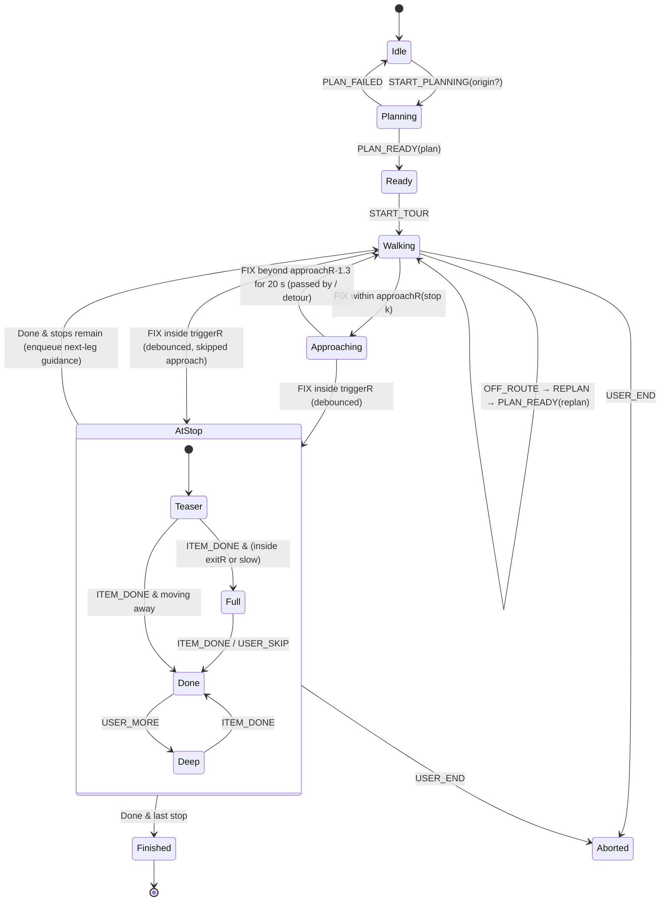

# CityTour: Technical Architecture

> Status: **build-from document**, written 2026-10-03 ~14:30 CEST for HackYeah 2026. It is binding for implementation unless the humans change it.
> Product decisions come from [`HACKATHON_BRIEF.md`](../HACKATHON_BRIEF.md). This document decides only the *how*.
>
> **Legend.**
> - **VERIFIED**: checked with `devecocli docs search/read` against the offline official HarmonyOS docs. The doc ID is listed in §14, *Verification ledger*.
> - **VERIFIED-RUN**: actually executed on this machine.
> - **ASSUMPTION**: not verified. It must be proven by the named spike before code depends on it.

---

## 0. Decisions at a glance

| # | Topic | Decision |
|---|---|---|
| D1 | UI architecture | MVVM with **State Management V2** (`@ComponentV2`, `@ObservedV2`/`@Trace`, `@Local`/`@Param`/`@Event`, `@Monitor`, `@Computed`), `Navigation` + `NavPathStack`. **No V1 decorators anywhere** (lint-enforced). |
| D2 | Logic placement | All decision logic lives in **pure ArkTS under `core/`**, with no `@kit.*` imports. It is unit-tested on the Mac with `hvigorw test`. Platform calls live only in `services/` adapters behind interfaces in `contracts/Ports.ets`. |
| D3 | Engine | `TourEngine` is a **pure reducer** `(state, event) → {state, effects[]}`. `TourController` (in the services layer) feeds it events and executes its effects. |
| D4 | Background | One continuous task with **`['location', 'audioPlayback']`** via `backgroundTaskManager.startBackgroundRunning(context, string[], wantAgent)` (API 12+), plus an **AVSession** of type `audio`. Started at tour start, stopped at tour end. |
| D5 | Voice | Core Speech Kit `textToSpeech`, `playType: 0`. PCM arrives through `onData` and plays through our own `AudioRenderer` (`STREAM_USAGE_AUDIOBOOK`, 16 kHz mono S16LE), one **sentence = one utterance**. |
| D6 | Geofencing | **Software geofences** in `core/tour/TriggerPolicy.ets` on the shared fix stream, not `addGnssGeofence`. |
| D7 | Map | **Native ArkUI `Canvas` vector map**, pre-baked from OSM into the offline pack, drawn with cached `Path2D` layers. Neither Web+Leaflet nor raster tiles. |
| D8 | Location | A `LocationSource` interface with `RealLocationSource` (Location Kit) and `DemoWalkSource` (a timestamped replay, labelled **SIMULATED**), both feeding one pipeline. |
| D9 | Routing | Exact **Held–Karp open path** from the user's position over an OSRM-foot duration matrix shipped in the pack. The same DP solves the **orienteering** ("I have N minutes") variant exactly. |
| D10 | Content | An offline city pack in `rawfile/packs/krakow/`, built by Node scripts in `scripts/pack/`. Narration is validated in the pipeline **and again in the app** (`NarrationValidator`), with a deterministic fallback chain. |
| D11 | Permissions | `APPROXIMATELY_LOCATION` + `LOCATION` (user grant, requested at point of use), `KEEP_BACKGROUND_RUNNING`, `VIBRATE`. **Not** `LOCATION_IN_BACKGROUND` (the continuous task makes it unnecessary, VERIFIED). **Not** `INTERNET` in v1. |
| D12 | Tests | Local unit tests (hypium) in `entry/src/test/`, run headless with `hvigorw test`, wrapped by `scripts/test.sh` (which must parse the result file because the exit code is always 0). |

### Two platform risks the whole team must know (VERIFIED in the docs)

1. **Region.** Location Kit (on non-wearables) and Core Speech Kit are documented as **"supported only in mainland China"**. The emulator is set to region CN (README setup step 2), so it is our primary target. On a real non-China device, TTS may fail and location may be "abnormal". That is why the **text-only fallback** (§9) and the **Demo walk** are first-class features, not afterthoughts.
2. **The English voice must be downloaded.** In the voice docs, `person 8` (Laura, en-US) is marked "需下载" (needs download), while zh `person 13` is built in. The onboarding flow must check `listVoices()` and call `downloadVoice()`. Spike S1 tests this on the emulator in the first hour.

---

## 1. System overview

### 1.1 Context and runtime diagram

```mermaid
flowchart TB
  subgraph DEV["Dev machine (build time, scripts/pack, Node 22)"]
    ARC[Kraków ArcGIS FeatureServer] --> PIPE
    OVP[OSM Overpass] --> PIPE
    WIKI[Wikipedia / Wikidata en,pl,zh] --> PIPE
    OSRM[OSRM foot router: table + route] --> PIPE
    LLM[LLM drafting, optional, key from env] --> PIPE
    PIPE[pack pipeline + validator] --> PACK[(rawfile/packs/krakow/*.json)]
    REV[Human review sheets] --> PIPE
  end

  subgraph APP["CityTour app process (EntryAbility, one UIAbility)"]
    subgraph V["View: pages/ + views/ (@ComponentV2)"]
      PG[Onboarding · Home · TourDetail · NowWalking · Map · PlaceDetail · Summary · Settings]
      MC[MapCanvas: ArkUI Canvas + Path2D]
    end
    subgraph VM["ViewModel: viewmodel/ (@ObservedV2 @Trace)"]
      NWVM[NowWalkingViewModel] --- MVM[MapViewModel] --- TPVM[TourPlanViewModel] --- SVM[SettingsViewModel]
    end
    subgraph SVC["Services: services/ (platform adapters, implement contracts/Ports)"]
      TC[TourController]
      RLS[RealLocationSource<br/>geoLocationManager]
      DWS[DemoWalkSource<br/>SIMULATED]
      NP[NarrationPlayer<br/>textToSpeech playType 0]
      PCM[PcmPlayer<br/>AudioRenderer]
      AVS[MediaSessionService<br/>AVSession]
      BG[BackgroundRunner<br/>backgroundTaskManager]
      NT[TourNotifier<br/>notificationManager]
      HP[Haptics<br/>vibrator]
      PR[RawfilePackRepository<br/>resourceManager]
    end
    subgraph CORE["Core: core/ (pure ArkTS, unit-tested, no @kit imports)"]
      ENG[TourEngine reducer]
      TP[TriggerPolicy]
      AQ[AnnouncementQueue]
      LT[LegTracker + Guidance]
      HK[HeldKarp / Planner]
      GEO[GeoMath · Projection · CourseEstimator · FixFilter · GridIndex]
      NV[NarrationValidator]
      PP[PackParser]
      PH[Phrases en/zh/pl]
    end
  end

  PACK --> PR --> PP
  RLS -- Fix --> TC
  DWS -- Fix --> TC
  TC -- events --> ENG
  ENG -- effects --> TC
  TC --> NP --> PCM
  AVS -- play/pause/next/prev/favorite --> TC
  TC --> AVS
  TC --> NT
  TC --> HP
  TC --> BG
  TC -- EngineSnapshot --> NWVM
  NWVM --> PG
  MVM --> MC
  ENG --- TP & AQ & LT
  TC --- HK
  PR --- NV
```



### 1.2 Layers and rules

| Layer | Folder | May import | Must not import | State mechanism |
|---|---|---|---|---|
| View | `pages/`, `views/` | `viewmodel/`, `contracts/` (types only), `common/` | `services/`, `core/` | `@ComponentV2`, `@Local` (UI-only state), `@Param`/`@Event` |
| ViewModel | `viewmodel/` | `contracts/`, `app/AppContainer` (to get services), `core/` (pure helpers such as formatting) | `@kit.*` platform APIs | `@ObservedV2` classes with `@Trace` fields, `@Computed` for derived values |
| Services | `services/`, `app/` | `@kit.*`, `contracts/`, `core/` | `viewmodel/`, `pages/` | plain classes; push to VMs through listener callbacks |
| Core | `core/` | `contracts/` only | **anything `@kit.*`**, `services/`, `viewmodel/` | none: pure functions and immutable-ish data |
| Contracts | `contracts/` | nothing | everything | types, enums and interfaces only |

**Why V2 (VERIFIED).** `@ComponentV2` and its family exist from API 12, so they fit our API 20 minimum. Navigation with V2 is documented (`NavPathStack` + `NavDestination.onReady`). The project is brand new, so there is no V1 code to stay compatible with (MVVM skill rule 1). The skill's two remaining V2 rules also apply: deep observation through `@Trace`, and `@Computed` instead of stored derived state.

- **Global singletons.** `AppViewModel` (language, source mode, permission state) is connected through `AppStorageV2.connect(AppViewModel, 'app', () => new AppViewModel())`.
- **User settings.** These live in `PersistenceV2.connect(UserSettings, 'settings', …)` (VERIFIED, the PersistenceV2 doc exists).
- **No god ViewModel.** Each page gets its own ViewModel, and `TourController` is *not* a ViewModel.

**Lifecycle.**
- `EntryAbility.onCreate` creates `AppContainer.init(context)`, which builds all services but starts nothing.
- `TourController` lives in `AppContainer`, not in a page, so screen lock or page navigation never destroys a tour.
- `EntryAbility.onDestroy` calls `TourController.shutdown()`. That stops location, stops the background task, releases the AudioRenderer, shuts down the TTS engines and destroys the AVSession.
- `onBackground` does nothing: the tour keeps running.

---

## 2. Platform capabilities: exact Kits and APIs

### 2.1 Summary table

| Capability | Kit / module | Key APIs | Permission | Emulator | Status |
|---|---|---|---|---|---|
| Continuous location | Location Kit, `geoLocationManager` from `@kit.LocationKit` | `on('locationChange', ContinuousLocationRequest{interval:1, locationScenario: UserActivityScenario.NAVIGATION}, cb)`, `off(...)`, `on('locationError')` (API 12), `isLocationEnabled()`, `getLastLocation()` | `APPROXIMATELY_LOCATION` + `LOCATION` | Kit supports emulator; GPS set from the emulator GUI only | VERIFIED |
| Background run | Background Tasks Kit, `backgroundTaskManager` from `@kit.BackgroundTasksKit` | `startBackgroundRunning(ctx, ['location','audioPlayback'], wantAgent)` (API 12), `stopBackgroundRunning(ctx)`, `on('continuousTaskCancel')` (15), `on('continuousTaskSuspend')` (20) | `KEEP_BACKGROUND_RUNNING` + `backgroundModes` in module.json5 | ASSUMPTION: works on emulator (spike S2) | VERIFIED API |
| TTS | Core Speech Kit, `textToSpeech` from `@kit.CoreSpeechKit` | `createEngine`, `listVoices` (19), `downloadVoice` (19), `setListener({onStart,onData,onComplete,onStop,onError})`, `speak(text, {requestId, extraParams:{playType:0,...}})`, `stop()`, `shutdown()` | none | "supported on emulator from 6.0.0(20)" | VERIFIED |
| Audio out | Audio Kit, `audio` from `@kit.AudioKit` | `audio.createAudioRenderer(options)`, `on('writeData')` (11), `on('audioInterrupt')` (9), `on('outputDeviceChangeWithInfo')` (11), `start/pause/stop/release`, `getAudioTimestampInfo` (19) | none | yes (speaker only) | VERIFIED |
| Lock-screen and headset controls | AVSession Kit, `avSession` from `@kit.AVSessionKit` | `createAVSession(ctx, 'CityTour', 'audio')`, `on('play'/'pause'/'playNext'/'playPrevious'/'toggleFavorite'/'stop')`, then `activate()`, `setAVMetadata`, `setAVPlaybackState`, `destroy` | none | supported (no casting, speaker only) | VERIFIED |
| Next-stop notification | Notification Kit, `notificationManager` from `@kit.NotificationKit` | `isNotificationEnabled`, `requestEnableNotification(ctx)`, `publish(NotificationRequest{id:1001, isAlertOnce:true, content BASIC_TEXT})` (same id updates in place), `cancel(1001)` | user consent dialog (not a module.json permission) | supported | VERIFIED |
| Haptics | Sensor Service Kit, `vibrator` from `@kit.SensorServiceKit` | `startVibration({type:'time', duration:60}, {usage:'notification'})` | `VIBRATE` | ASSUMPTION: no-op on emulator | VERIFIED API |
| Localization | Localization Kit `i18n` + resource qualifiers | `i18n.System.setAppPreferredLanguage('pl-PL')`, `resources/{en_US,pl_PL,zh_CN}/element/string.json` | none | yes | VERIFIED (`pl_PL` folder name is an ASSUMPTION; the pattern is verified with `en_US`/`zh_CN`/`ja_JP`) |
| Home widget (P2) | Form Kit | `FormExtensionAbility`, `form_config.json`, `formProvider.updateForm(formId, formBindingData)` | none | widgets supported | VERIFIED API |
| Compass (P2, map cone when screen on) | Sensor Service Kit `sensor` | `sensor.on(sensor.SensorId.ORIENTATION, cb, {interval})` | none | GUI-simulated | VERIFIED |
| Keep-screen-on fallback | ArkUI `window` | `windowClass.setWindowKeepScreenOn(true)` | none | yes | VERIFIED |
| Live View (实况窗) | Live View Kit | n/a | **AGC approval, app must be published with ≥1000 MAU** | n/a | **OUT OF SCOPE** (VERIFIED requirement) |
| Hardware geofence | `geoLocationManager.addGnssGeofence` | n/a | LOCATION | chip-dependent, returns `801` if unsupported | **NOT USED** (see D6) |

### 2.2 module.json5 changes (owner: Person A, one small PR, merged first)

```json5
// entry/src/main/module.json5, inside "module"
"requestPermissions": [
  { "name": "ohos.permission.APPROXIMATELY_LOCATION", "reason": "$string:perm_location_reason",
    "usedScene": { "abilities": ["EntryAbility"], "when": "inuse" } },
  { "name": "ohos.permission.LOCATION", "reason": "$string:perm_location_reason",
    "usedScene": { "abilities": ["EntryAbility"], "when": "inuse" } },
  { "name": "ohos.permission.KEEP_BACKGROUND_RUNNING", "reason": "$string:perm_background_reason",
    "usedScene": { "abilities": ["EntryAbility"], "when": "always" } },
  { "name": "ohos.permission.VIBRATE", "reason": "$string:perm_vibrate_reason",
    "usedScene": { "abilities": ["EntryAbility"], "when": "inuse" } }
],
// in abilities[0] (EntryAbility):
"backgroundModes": ["location", "audioPlayback"]
```

Reason strings (add to `base` plus each language folder):

| key | en | pl | zh |
|---|---|---|---|
| `perm_location_reason` | CityTour uses your precise location to start a story when you reach a monument and to guide you to the next stop. | CityTour używa dokładnej lokalizacji, aby opowiedzieć o zabytku, gdy do niego dojdziesz, i poprowadzić Cię do kolejnego przystanku. | CityTour 使用您的精确位置，在您到达古迹时开始讲解，并引导您前往下一站。 |
| `perm_background_reason` | Keeps the tour guide running and talking while your phone is locked in your pocket. | Pozwala przewodnikowi działać i mówić, gdy telefon jest zablokowany w kieszeni. | 在手机锁屏放在口袋里时，导览仍可继续运行并讲解。 |
| `perm_vibrate_reason` | A short vibration tells you that you have arrived at a stop. | Krótka wibracja informuje, że dotarłeś do przystanku. | 到达景点时短暂振动提示。 |

**Where permissions are requested.**
- Location: on Onboarding's "Allow location" step and again when "Start tour" is tapped with a real source. The call is `abilityAccessCtrl.createAtManager().requestPermissionsFromUser(ctx, ['ohos.permission.APPROXIMATELY_LOCATION','ohos.permission.LOCATION'])`. After a denial, use `requestPermissionOnSetting()` (VERIFIED).
- Notifications: `requestEnableNotification` runs at tour start.

### 2.3 Location Kit

- **Request.** Use `ContinuousLocationRequest { interval: 1, locationScenario: geoLocationManager.UserActivityScenario.NAVIGATION }` (VERIFIED). NAVIGATION is documented as "outdoor real-time position, in-car **and walking navigation**".
- **Fields used** (VERIFIED on the `Location` type):
  - `latitude`, `longitude` (WGS-84 only; OSM is also WGS-84, so no conversion)
  - `accuracy` (m), `speed` (m/s), `direction` (deg 0–360), `timeStamp` (ms)
  - optional `directionAccuracy` (12+), `speedAccuracy` (12+), `sourceType` (12+: GNSS=1 / NETWORK=2 / INDOOR=3 / RTK=4)
- **Rates (VERIFIED, FAQ faqs-location-11/27).**
  - GNSS reports every 1 s.
  - **Network fallback reports every 20 s.** The first fixes may come from the network, and the system falls back to network after 30 s without GNSS. Our `FixFilter` therefore tolerates 20 s gaps and marks `sourceType=NETWORK` fixes as *not trigger-grade* unless `accuracy ≤ 25 m`.
- **Errors.**
  - `on('locationError')` codes: `-2` permission, `-3` background permission, `-4` switch off, `-5` network.
  - Exceptions on `on()`: `201`, `801`, `3301000` (service unavailable), `3301100` (switch off).
  - If the switch is off, call `requestGlobalSwitch` (VERIFIED, FAQ faqs-location-22).
- **Background.** The foreground permissions plus a **LOCATION continuous task** are sufficient (VERIFIED, location-permission-guidelines: "除了按照步骤2申请权限外，还需要申请LOCATION类型的长时任务"). We do not request `LOCATION_IN_BACKGROUND`.
- **Power.** GNSS runs at 1 Hz regardless of `interval` (VERIFIED). Call `off()` immediately when the tour ends or pauses for more than 10 min.
- **Geofencing.**
  - `addGnssGeofence` exists (API 12): max 100 fences, circle only, chip-dependent `801`, and `loiterTimeMs` (dwell) only from API 23.
  - We **do not use it**: (a) the Demo walk must exercise the *same* trigger logic; (b) it is hardware-dependent and untestable on the emulator; (c) we need speed/dwell/accuracy-aware hysteresis anyway.
  - Software geofences on 1 Hz fixes are exact enough for 30–80 m radii.
- **Region caveat.** See the §0 risk box.

### 2.4 Background Tasks Kit: which mode is right for "screen locked, narrating"?

These docs facts (VERIFIED) drive the choice:
- "For audio usages MUSIC/MOVIE/AUDIOBOOK/GAME in background you must use AVSession **and** an AUDIO_PLAYBACK continuous task."
- "If an app has audio playback in background without an audio continuous task, the system kills it."
- An "AUDIO_PLAYBACK task with no valid audio playing → app may be frozen" (suspend reason `SYSTEM_SUSPEND_AUDIO_PLAYBACK_NOT_RUNNING`).
- A "LOCATION task without location use" leads to suspension.
- `startBackgroundRunning(context, bgModes: string[], wantAgent)` accepts **multiple modes in one task** (API 12+). Multiple *separate* tasks are API 21+, which is above our min 20, so we don't use that overload.

**Decision.**
- **LOCATION alone is wrong**: background speech would be killed or muted.
- **AUDIO_PLAYBACK alone is wrong**: we are silent between stops for minutes, which risks a freeze.
- So we request **both modes in one call**: `['location', 'audioPlayback']`. The Location task justifies the process being alive between stories, and the audio task plus AVSession justifies speech.
- In Demo walk mode `RealLocationSource` **keeps running** in parallel (its fixes are shown as "real GPS: …" in the debug strip but not fed to the engine). The LOCATION task therefore stays honest, because Location Kit really is in use.

```ts
// services/background/BackgroundRunner.ets (sketch)
import { backgroundTaskManager } from '@kit.BackgroundTasksKit';
import { wantAgent, common } from '@kit.AbilityKit';

const info: wantAgent.WantAgentInfo = {
  wants: [{ bundleName: ctx.abilityInfo.bundleName, abilityName: ctx.abilityInfo.name }],
  actionType: wantAgent.OperationType.START_ABILITY, requestCode: 0,
  actionFlags: [wantAgent.WantAgentFlags.UPDATE_PRESENT_FLAG]
};
const agent = await wantAgent.getWantAgent(info);
await backgroundTaskManager.startBackgroundRunning(ctx, ['location', 'audioPlayback'], agent);
backgroundTaskManager.on('continuousTaskCancel', (i) => controller.dispatch(Ev.bgCancelled(i.reason)));
backgroundTaskManager.on('continuousTaskSuspend', (i) => log.w('BG_SUSPEND', `reason=${i.suspendReason}`)); // API 20
```

- **When.** At `START_TOUR`, from the foreground: `NowWalkingPage`'s "Start" button triggers `TourController.start()`, which holds the `UIAbilityContext` from `AppContainer`. Stop at `Finished`/`Aborted`/`shutdown()`. Stop it *before or with* stopping audio (VERIFIED: "停止长时任务的同时，需要暂停或停止音频流，否则应用会被系统强制终止").
- **Notification.** From API 20, once AVSession is connected, "the background task module sends no notification; AVSession sends it" (VERIFIED). Our lock-screen and notification-shade presence is therefore the **AVSession media card**, whose metadata we keep meaningful (§2.6).
- **Spike S2 (ASSUMPTION to prove in hour 1–2).** Lock the emulator screen, run the Demo walk for 3 min, and check for: no `BG_SUSPEND` log; the next story playing; fixes keeping arriving.
  - **Fallback B, if suspension happens during silent gaps:** keep the `AudioRenderer` started for the whole tour and write zero-PCM between items. The session really is an active narration session; we would disclose this in README.
  - **Fallback C:** `setWindowKeepScreenOn(true)` plus a "keep screen on" banner.

### 2.5 Core Speech Kit TTS → Audio Kit

**Engines.** We create one engine per spoken language, lazily, and keep both alive for the tour (the system-wide limit is 3 instances, VERIFIED):

| lang | `CreateEngineParams` |
|---|---|
| zh-CN | `{ language:'zh-CN', person:13, online:1, extraParams:{ style:'interaction-broadcast', locate:'CN', name:'citytour-zh', isBackStage:true } }` (聆小珊, built in) |
| en-US | `{ language:'en-US', person:8, online:1, extraParams:{ style:'interaction-broadcast', locate:'CN', name:'citytour-en', isBackStage:true } }` (Laura, **needs download**) |

- `online` must be `1` (offline): online mode is unsupported (VERIFIED).
- `name` must be unique, otherwise `shutdown()` of one engine kills the other (VERIFIED, FAQ faqs-core-speech-1).
- `isBackStage: true` enables background broadcasting (VERIFIED).

**Voice availability.**
1. At onboarding and at app start, `textToSpeech.listVoices({requestId: uuid, online: 1})` returns `VoiceInfo{language, person, status: 'GA'|'INSTALLED'|'EOM'}`.
2. If en/8 is `GA`, show "Download English voice" and call `downloadVoice({requestId, language:'en-US', person:8, style:'interaction-broadcast'}, cb)`. This shows a system dialog. Track `DownloadResponse.on('progress'|'complete'|'error'|'cancel')`.
   - Error `1002300010` means "already downloaded", which counts as success.
   - Error `1002300008` means the download failed.
3. **Fallback if the English voice is unavailable (ASSUMPTION, spike S1).** The docs list "中文语境下的英文" (English in a Chinese context) as supported, so the zh engine can read English text. Offer "Speak English with the Chinese voice (accented)". If that is also unusable, go **text-only** (§9).

**Speaking.**
- `speak(sentence, { requestId: '<itemId>#<idx>#<uuid>', extraParams: { playType: 0, queueMode: 0, speed: persona.speed, pitch: persona.pitch, volume: 1.0, languageContext: lang, audioType: 'pcm' } })`.
- Each `requestId` may be used **only once** (VERIFIED).
- Text must be ≤ 10000 chars (VERIFIED, error `1002300001`). Our sentences are far shorter.
- **Pauses.** `[p300]` inline markup inserts a 300 ms silence (VERIFIED). Narration sentences may contain `[pN]`; the UI strips `\[p\d+\]` before display.

**PCM format.**
- `StartResponse` states that sampleRate is always **16000** and sampleBit **16** (VERIFIED).
- The channel count is "depends on input". ASSUMPTION: mono. We log `onStart` and assert `audioChannel === 1`, otherwise we recreate the renderer with `CHANNEL_2`.
- `onData(requestId, audio: ArrayBuffer, {sequence})`: chunks **must be ordered by `sequence`** (VERIFIED).
- `onComplete(requestId, {type})`: `type 0` means synthesis finished. With `playType 0` the synthesis end is what we get; playback end is ours to detect.

**AudioRenderer (`services/audio/PcmPlayer.ets`).**

```ts
const options: audio.AudioRendererOptions = {
  streamInfo: { samplingRate: audio.AudioSamplingRate.SAMPLE_RATE_16000, channels: audio.AudioChannel.CHANNEL_1,
                sampleFormat: audio.AudioSampleFormat.SAMPLE_FORMAT_S16LE, encodingType: audio.AudioEncodingType.ENCODING_TYPE_RAW },
  rendererInfo: { usage: audio.StreamUsage.STREAM_USAGE_AUDIOBOOK, rendererFlags: 0 }
};
renderer.on('writeData', (buf: ArrayBuffer) => { /* copy next bytes from current utterance queue, else zero-fill */ });
renderer.on('audioInterrupt', (e: audio.InterruptEvent) => controller.dispatch(Ev.audioInterrupt(e.hintType)));
renderer.on('outputDeviceChangeWithInfo', (info) => /* headphones removed → pause */);
```

- **Stream usage.** `STREAM_USAGE_AUDIOBOOK`, documented as "audiobooks, news, **podcasts**" (VERIFIED). It is the honest category for long narration, and it triggers the system's correct focus and volume behaviour (media volume keys).
  - We do not use `NAVIGATION`: stories are minutes long, and NAVIGATION usage is meant for short prompts.
  - We do not use the default TTS channel `soundChannel 3` (Xiaoyi voice-assistant volume), which has the known "volume can't be adjusted" problem (VERIFIED, FAQ faqs-core-speech-10).
- **Interrupt handling** (`InterruptHint`, VERIFIED):
  - `PAUSE` → pause the engine at the current sentence; on `RESUME`, replay that sentence from its start.
  - `STOP` → pause and wait for the user.
  - `DUCK`/`UNDUCK` → system-handled, log only.
- **Playback-end detection.** There is no end-of-stream API (VERIFIED, FAQ faqs-audio-56). `PcmPlayer` counts bytes consumed by `writeData` per utterance. When the utterance's bytes are fully consumed **and** its synthesis is complete, it schedules `onUtteranceDone` after `bufferDurationMs = getBufferSizeSync() / 32` (16 kHz × 2 B = 32 B/ms). Fallback: poll `getAudioTimestampInfo` every 250 ms until the frame position stops advancing.
- **Prefetch.** `NarrationPlayer` synthesizes sentence *n+1* while *n* plays (look-ahead = 1) to hide TTS latency. If the queue preempts, the prefetched PCM is dropped.

### 2.6 AVSession (lock screen, headset, notification card)

**Setup.** `createAVSession(ctx, 'CityTour', 'audio')`. **Register commands first, then `activate()`** (VERIFIED order).

| AVSession command | Our meaning | Engine event |
|---|---|---|
| `play` / `pause` | resume / pause the guide | `USER_RESUME` / `USER_PAUSE` |
| `playNext` | skip the rest of this story (after the current sentence) | `USER_SKIP` |
| `playPrevious` | replay the current or last story from its start | `USER_REPLAY` |
| `toggleFavorite` | **"Tell me more"**: queue the `deep` narration | `USER_MORE` |
| `stop` | pause the tour (we never end a tour from the lock screen) | `USER_PAUSE` |

The audio template shows favorite / previous / play-pause / next / loop (VERIFIED). We call `off` for unsupported commands.

**Metadata.** `setAVMetadata({ assetId: tourId+stopId, title, artist: 'CityTour · Historian', album: tourTitle, mediaImage?: PixelMap of stop photo (P2), duration: -1 })`. The title changes with state:
- Walking: **"Next: Wawel Cathedral · 240 m"**. Updated at most every 15 s and only if the distance changed by ≥ 20 m.
- Narrating: **"Now: St. Mary's Basilica"**.
- Off-route: "Off route, recalculating".

**Playback state.** `setAVPlaybackState({ state: PLAYBACK_STATE_PLAY | PLAYBACK_STATE_PAUSE })`, kept in sync with the actual engine state (VERIFIED requirement: the media card mirrors exactly what we report).

The session lives for the whole tour (VERIFIED caveat: it must not be GC'd while playing in background). `destroy()` runs at the end.

### 2.7 Notification Kit ("Next: Wawel 240 m")

- **Consent.** `isNotificationEnabled()`, then `requestEnableNotification(ctx)` at tour start. Error `1600004` means the user refused; keep silent and log.
- **One notification, updated in place.** Publish `id: 1001` with `notificationSlotType: OTHER_TYPES`, `isAlertOnce: true` (alerts only the first time), `content: BASIC_TEXT{ title: 'Next: Wawel Cathedral', text: '240 m · ~3 min · on your left', additionalText: '5/12' }`, and a `wantAgent` that opens NowWalking.
  - It is updated on stop change and every ≥ 50 m. The rate limits (≤ 20 updates/s) are irrelevant at that frequency (VERIFIED).
  - `isOngoing` is "reserved, not supported" (VERIFIED), so the notification is dismissible, and that's fine.
  - Cancel at tour end.
- Arrival events also rely on the haptic, not on a separate notification, to avoid spam.

### 2.8 Haptics, sensors, Form widget

- **Vibrator.** On arrival: `vibrator.startVibration({ type: 'time', duration: 80 }, { usage: 'notification' })`. When off-route: two pulses using `{type:'preset', effectId:'haptic.clock.timer', count: 2}`, checked first with `isSupportEffect`. The vibrate permission is required (VERIFIED).
- **Orientation sensor (P2).** `sensor.on(SensorId.ORIENTATION)` drives the map's heading cone **only while the map is visible and the screen is on**. Spoken left/right cues **always use course-over-ground** (§4.5), because a phone in a pocket has a meaningless compass heading.
- **Form widget (P2).** A 2×2 "Next stop" card shows the tour name, next stop, distance and progress k/n. It needs `formability/EntryFormAbility.ets` (`FormExtensionAbility`), `resources/base/profile/form_config.json` and `widget/pages/NextStopCard.ets`. `TourController` calls `formProvider.updateForm(formId, formBindingData.createFormBindingData(obj))` on stop change. Form IDs are persisted from `onAddForm`.

---

## 3. Map decision

### 3.1 Options evaluated

| Criterion | (a) Native Canvas vector map, pre-baked from OSM | (b) Native OSM raster tile view | (c) Web component + Leaflet |
|---|---|---|---|
| Platform score ("unchanged on any OS scores lower") | **High**: ArkUI `Canvas`, `Path2D`, gesture system, the same projection code as the engine | Medium: native, but just image tiles | **Low**: a web map in a WebView is exactly "runs unchanged elsewhere" |
| Offline (locked-pocket tour, possibly no data roaming) | **Fully offline**, ships in the pack | Needs network, or pre-seeded tiles that the OSM tile policy forbids | Needs network (same tile problem) plus web assets |
| OSM tile usage policy | n/a (we use *data* under ODbL, not tiles) | The OSMF tile servers forbid bulk/offline prefetch and require a valid UA and attribution (ASSUMPTION: well-known policy, not in the HarmonyOS docs). Self-rendering tiles is too much work. | Same as (b) |
| Design quality | **We control the style**: a custom palette and only the layers that matter (heritage zone, stops, route). Looks bespoke on stage. | Generic OSM look; raster text on HiDPI | Generic, though Leaflet is polished |
| Effort | ~6–8 h (pipeline layer extraction ~2 h, renderer ~3 h, gestures and hit-testing ~2 h) | ~5 h tile math plus cache, still online | ~2–3 h |
| Risk | Canvas performance with ~6k buildings (spike S3, mitigations exist) | Network on stage | WebView bridging, plus a jury penalty |

**Decision: (a) native Canvas vector map.** It is the only option that is offline (which the product requires: the phone is in a pocket and the tour data is "installed"). It scores on the platform-capability criterion, avoids the tile policy entirely, and lets the map share `core/geo/Projection.ets` with the engine. Its extra effort is bounded, because the map is static data drawn once into cached `Path2D` objects.

### 3.2 Implementation

**Projection (shared by the pipeline and the app).** We use a local equirectangular (ENU) projection around the pack origin `O = (lat0, lng0)`, which is Rynek Główny `50.06143, 19.93658`:

```
x = (lng − lng0) · cos(lat0·π/180) · 111320.0      // metres east
y = (lat − lat0) · 110574.0                        // metres north
```

Error is < 0.2 % within 5 km, which is irrelevant for walking. The pipeline stores map geometry in **decimetres as integers** (smaller JSON). The app converts fixes with the same formula (`core/geo/Projection.ets`). A unit test pins both constants to the pipeline's output for 3 reference points.

**Camera.** `{ cx, cy (metres), s (px per metre), followUser: boolean }`. Screen mapping: `sx = (x − cx)·s + W/2`, `sy = −(y − cy)·s + H/2`. Zoom is clamped to `s ∈ [0.12, 8]`, which runs from a whole-city overview to street level. The map is north-up; heading-up is not needed.

**Gestures** (ArkUI, VERIFIED components):

```ts
Canvas(this.ctx)
  .onReady(() => this.renderer.draw())
  .gesture(GestureGroup(GestureMode.Parallel,
     PanGesture({ fingers: 1, distance: 4 }).onActionUpdate((e: GestureEvent) => vm.pan(e.offsetX, e.offsetY)),
     PinchGesture({ fingers: 2 }).onActionUpdate((e: GestureEvent) => vm.pinch(e.scale, e.pinchCenterX, e.pinchCenterY))))
  .gesture(TapGesture({ count: 2 }).onAction(() => vm.zoomIn()))
  .onClick((e: ClickEvent) => vm.hitTest(e.x, e.y))   // nearest POI within 24 px via GridIndex
```

Panning disables follow mode; a "recenter" button re-enables it. Pan/pinch deltas update `MapViewModel.camera` (a `@Trace` field), and an `@Monitor('camera')` triggers a redraw.

**Rendering (`views/map/MapRenderer.ets`, a plain class that takes `CanvasRenderingContext2D`).**

- At load, build **one `Path2D` per style class** in world metres (`moveTo`/`lineTo`/`closePath`) for `water`, `green`, `buildings`, `unesco`, `paths`, `minor`, `major`, `river`. That is ~10 paths in total.
- Per frame:
  1. `ctx.setTransform(s, 0, 0, −s, W/2 − cx·s, H/2 + cy·s)`.
  2. For each layer in z-order, set `fillStyle`/`strokeStyle`, set `lineWidth = px / s`, then `ctx.fill(path)` or `ctx.stroke(path)`.
  3. `ctx.resetTransform()`, then draw screen-space overlays.
- **Layers, bottom to top:**
  1. land background
  2. water (Vistula)
  3. green (Planty ring, Błonia, parks)
  4. UNESCO zone outline (dashed)
  5. buildings: fill always; 1 px darker stroke when `s > 1.5`
  6. paths/footways when `s > 1`, minor streets, major streets (casing plus fill)
  7. **route**: remaining legs as a 6 px accent with a white casing; walked part grey
  8. POI dots (all-Kraków layer): importance ≥ 0.6 when `s < 1`, all when `s ≥ 2`, culled by `GridIndex` to the viewport
  9. **stop markers**: numbered circles in planned order; visited ones get a check; the current one pulses
  10. **user**: accuracy circle (alpha 0.15, radius `accuracy·s`), a 7 px dot, and a **course cone** (±25° wedge, 48 px long, from `CourseEstimator`, hidden when the course is unknown). In DEMO mode the dot is amber with a "SIMULATED" chip on the map.
  11. stop name labels (`fillText`) when `s > 1.2`
  12. the attribution **"© OpenStreetMap contributors"**, bottom-left (an ODbL obligation)
- **Two detail levels.** `overview` covers the whole city (river, major roads, big parks; low detail) so every POI in Kraków can be shown. `detail` covers the Old Town + Wawel + Kazimierz + Podgórze bbox `lat 50.040–50.072, lng 19.915–19.960` with buildings and all streets.
- **Spike S3 (ASSUMPTION): 60 fps not required, ≥ 30 fps while panning with ~6k buildings.**
  - Mitigation 1: during a gesture draw only `major + route + markers`, and draw the full map on gesture end.
  - Mitigation 2: rasterise static layers into an `OffscreenCanvas` at the current zoom and blit the bitmap while panning.
- **Mini-map.** `NowWalking` reuses `MapCanvas` with `interactive: false`, `followUser: true`, `s = 3`.

---

## 4. Tour engine

### 4.1 State machine



**Orthogonal flags** (not states):
- `paused`: set by the user, AVSession or an audio interrupt.
- `signal: Good | Poor | Lost`.
- `offRoute: boolean`.
- `speechMode: Voice | TextOnly`.

While `paused`, fixes still update position and progress, but **no new item is started**. Arrivals during a pause are queued, and stale ones expire.

### 4.2 Events and effects (in `contracts/EngineTypes.ets`)

- **Events:**
  - planning: `START_PLANNING`, `PLAN_READY`, `PLAN_FAILED`, `START_TOUR`
  - location: `FIX`, `FIX_TIMEOUT`
  - speech: `UTTERANCE_STARTED`, `UTTERANCE_DONE`, `UTTERANCE_FAILED`
  - user: `USER_PAUSE`, `USER_RESUME`, `USER_SKIP`, `USER_REPLAY`, `USER_MORE`, `USER_END`
  - platform: `AUDIO_INTERRUPT(hint)`, `AUDIO_ROUTE_LOST`, `BG_CANCELLED(reason)`
  - clock: `TICK(nowMs)` at 1 Hz, for dwell timers and expiry
- **Effects:**
  - speech: `SPEAK(utterance)`, `STOP_SPEECH(afterCurrent: boolean)`
  - platform: `SET_MEDIA_META`, `SET_MEDIA_STATE`, `NOTIFY_NEXT`, `HAPTIC(kind)`
  - control: `REQUEST_REPLAN`, `PERSIST_PROGRESS`, `LOG(code, kv)`

The reducer never calls a service. `TourController` executes the effects in order.

### 4.3 Trigger logic (`core/tour/TriggerPolicy.ets`, pure)

All constants live in `core/tour/TourConfig.ets` (tunable, logged at start):

| Constant | Default | Meaning |
|---|---|---|
| `triggerRadiusM` | per stop from pack (default 35; Rynek 70; Wawel courtyard 60) | arrival geofence |
| `approachRadiusM` | 110 | "coming up" cue |
| `exitFactor` | 1.6 | hysteresis: exit = `triggerR · 1.6` |
| `maxTriggerAccuracyM` | 40 | fixes worse than this never cause arrival or exit (they still move the dot) |
| `enterConfirmFixes` | 2 consecutive fixes within ≥ 1.5 s, **or** 1 fix with `d ≤ 0.5·triggerR` | debounce against jitter |
| `exitConfirmFixes` | 3 consecutive fixes beyond the exit radius | debounce |
| `slowSpeedMps` | 0.6 | "stopped / lingering" |
| `fullStoryDwellS` | 8 | inside triggerR ≥ 8 s ⇒ the user has stopped |
| `speedWindow` | median of the last 5 trigger-grade speeds | speed smoothing |

**Accuracy-aware distance.** `dEff = max(0, d − min(accuracy, 15))` for **entry** (benefit of the doubt with a decent fix) and `d + min(accuracy, 15)` for **exit** (conservative). Combined with the 1.6× exit radius, a user standing at the edge of the radius with ±15 m jitter triggers **exactly once**. That is a unit test.

**Teaser vs full** (decided at sentence boundaries, never mid-sentence):

1. On arrival, enqueue a **P2 `STOP_STORY` item** = `[arrivalLine, ...teaser.sentences]`.
   - Example `arrivalLine`: "St. Mary's Basilica is on your left. Look up at the taller tower."
   - It is built from `Phrases` + `RelDir` + `Poi.view`.
2. When the teaser item completes, if `insideExit || speedMedian < slowSpeedMps || dwell ≥ fullStoryDwellS`, enqueue the **full** narration (P2, same stop). Otherwise mark the stop `TeaserOnly` and log `STORY_SKIP_MOVING`. The full text stays available in PlaceDetail and through `USER_REPLAY`.
3. The user can always ask for more with `USER_MORE` (AVSession favorite or the in-app button), which queues the `deep` narration if it exists.
4. A stop is spoken **at most once automatically per tour**. Replays happen only through the user.

**Proposal flag.** "Full if they stop, teaser if they walk past" was an *unconfirmed proposal* in the brief. It is cheap and testable, so it is implemented behind `UserSettings.adaptiveLength` (default **on**). The humans may switch the default.

### 4.4 Announcement queue (`core/tour/AnnouncementQueue.ets`, pure)

```
Announcement { id, priority: Priority, kind: AnnouncementKind, poiId?, utterances: Utterance[], cursor, expiresAtMs, dedupeKey }
Priority: P0_SYSTEM (gps lost, off-route) > P1_NAV (turn cues) > P2_STORY (stop narration) > P3_APPROACH > P4_AMBIENT (nearby non-tour POI)
```

- **One utterance in flight at a time.** The queue hands `NarrationPlayer` the *next sentence* only after `UTTERANCE_DONE`. That makes "never interrupt mid-sentence" structural, not a convention.
- **Preemption.** When a higher-priority item arrives while a lower one is mid-item, the lower item's `cursor` is kept, the higher item plays at the next sentence boundary, and the lower item **resumes at its cursor**. A P2 story is never dropped by a P1 nav cue; it's interleaved.
- **Expiry.** Defaults: P0 30 s, P1 20 s (a turn cue is useless later), P3 30 s, P4 60 s, P2 never. Expired items are dropped with `LOG(QUEUE_EXPIRED)`.
- **Dedupe.** The same `dedupeKey` (for example `nav:leg3:step5`, `approach:poi_x`) is enqueued at most once.
- **`USER_SKIP`** sets `STOP_SPEECH(afterCurrent=true)` and drops the rest of the current item. **`USER_PAUSE`** sets `STOP_SPEECH(afterCurrent=false)` and stops the renderer immediately. A *user* pause is the one case where cutting mid-sentence is correct; on resume the sentence restarts from its beginning.
- **Text-only mode.** The queue still advances on a timer of `max(2.5 s, words / 2.6 words·s⁻¹)` per sentence, so on-screen captions and the engine flow behave the same.

### 4.5 Direction cues ("on your left") from course over ground

`core/geo/CourseEstimator.ets` decides the course this way:
1. If `fix.speed ≥ 0.5` and `fix.direction` is valid (and `directionAccuracy ≤ 45` when present), use `fix.direction`.
2. Else use the bearing from the fix ≥ 8 m back in history (within 30 s).
3. Smooth by a vector average of the last 3 estimates.
4. Keep the last valid course for 60 s after the user stops (they stopped *facing* the way they walked).
5. Otherwise the course is unknown.

Then `rel = normalize(bearing(user → poi) − course)` in (−180, 180]:

| `rel` | `RelDir` | en | zh | pl (text) |
|---|---|---|---|---|
| ≤ 25 | AHEAD | straight ahead | 就在正前方 | prosto przed Tobą |
| 25…70 | AHEAD_RIGHT | ahead on your right | 在右前方 | z przodu po prawej |
| 70…120 | RIGHT | on your right | 在您右侧 | po Twojej prawej |
| 120…160 | BEHIND_RIGHT | behind you, on the right | 在您右后方 | za Tobą, po prawej |
| > 160 | BEHIND | behind you | 在您身后 | za Tobą |
| (mirror) | AHEAD_LEFT / LEFT / BEHIND_LEFT | … | … | … |
| d < 15 m or course unknown | HERE | right here / around you | 就在这里 | tutaj |

**Look up.** `Poi.view = { look: UP | LEVEL | DOWN, featureKey }` adds a second clause such as "Look up at the taller tower" or "Look down at the plaque in the pavement". It comes from reviewed data, never computed.

### 4.6 Turn-by-turn between stops (`core/route/LegTracker.ets` + `Guidance.ets`)

- **Input.** The pack ships an OSRM route (`steps=true`, `overview=full`) for **every directed pair of tour stops** (12 stops → 132 legs). The order is decided at runtime, so all pairs are needed.
- **Leg 0 (user → first stop).** It has no precomputed geometry. We use **bearing guidance** ("Wawel Cathedral is 420 m ahead on your left") until the user is within 30 m of any precomputed leg polyline, then snap to it. (Stretch: one online OSRM route call with a 5 s timeout. It would need `INTERNET`, so it is not in v1.)
- **Progress.** Project the fix onto the leg polyline (`pointToSegment`, monotonic search from the last index) to get `alongM` and `crossTrackM`, the next step and `distToManeuverM`.
- **Cues** (P1, dedupe per step):
  - "prepare": at `distToManeuver ≤ 30 m`, "In 30 metres, turn left onto Grodzka."
  - "now": at `≤ 8 m`, "Turn left now."
  - `continue` / `new name` steps are announced only if the segment is longer than 250 m ("Continue straight for 300 metres").
  - `depart` is merged into the "Next stop" line.
  - `arrive` is ignored, because the stop trigger handles it.
- **Street names.** Polish OSM names are spoken in **en** (acceptable) but **omitted in zh** ("前方路口左转"), because Polish names through the zh voice are unintelligible. The full name is shown in the UI.
- **Templates.** Maneuver × modifier → phrase in `core/content/Phrases.ets` (en, zh, pl). This is deterministic code, not AI.

### 4.7 Off-route detection and re-plan

- **Off-route** when `crossTrackM > max(35, 20 + min(accuracy, 30))` for ≥ 12 s **and** ≥ 3 trigger-grade fixes. Clear it when `crossTrackM < 20` for 2 fixes.
- **On entering off-route:**
  1. Enqueue P0 "You've left the route. {next stop} is {d} metres {relDir}." (once per 60 s).
  2. `HAPTIC(OFF_ROUTE)`.
  3. `REQUEST_REPLAN`.
- **Re-plan.** `TourController` runs `Planner.replan(remainingStops, currentFix)`: Held–Karp from the current position, < 5 ms. If the next stop changes, log `REPLAN from=a to=b` and say "New plan: we'll visit {b} first." Guidance falls back to bearing mode until the user snaps onto the new leg (≤ 30 m).
- **Skipping a stop.** If the user ends up nearer a later stop and the planner reorders, the skipped stop stays *pending* (it is not lost).

---

## 5. LocationSource abstraction

```ts
// contracts/Ports.ets
export enum FixSource { REAL = 'real', DEMO = 'demo' }
export interface Fix {
  lat: number; lng: number;          // WGS-84
  accuracyM: number;                 // horizontal, metres
  speedMps: number;                  // NaN if unknown
  courseDeg: number;                 // 0..360, NaN if unknown
  courseAccuracyDeg: number;         // NaN if unknown
  timestampMs: number;               // UTC ms
  provider: number;                  // 1 GNSS, 2 NETWORK, 3 INDOOR, 4 RTK, 0 unknown/demo
  source: FixSource;
}
export type FixListener = (fix: Fix) => void;
export type LocationErrorListener = (code: number, message: string) => void;
export interface LocationSource {
  readonly kind: FixSource;
  start(onFix: FixListener, onError: LocationErrorListener): Promise<void>;
  stop(): void;
  isRunning(): boolean;
}
```

- **`RealLocationSource`** (`services/location/RealLocationSource.ets`)
  - It maps `geoLocationManager.Location` to `Fix`. `direction` becomes `courseDeg`, and `direction` is treated as invalid when `speed < 0.3`.
  - It subscribes `on('locationError')` and maps its codes to `LocationErrorListener`.
  - It holds the **same callback reference** for `off()` (VERIFIED requirement).
  - It is constructed only after the permission check.
- **`DemoWalkSource`** (`services/location/DemoWalkSource.ets`) wraps the pure `core/sim/DemoWalkPlayer.ets`.
  - The track file is `rawfile/demo/royal-route-walk.json`: `DemoTrack { id, name, simulated: true, generatedBy: 'scripts/demo/make-demo-walk.mjs', fixes: DemoFix[] }`, where `DemoFix = Fix fields + tRelMs + hold?: boolean`.
  - It emits through `setInterval(…, 1000)` with `speedMultiplier ∈ {1, 2, 4, 8}`.
  - **Hold segments.** At stops, `hold: true` fixes are re-emitted (standing still, with jitter) **while `holdPredicate()` returns true**. The controller wires that predicate to `queue.isStoryActive()`, so at ×8 the demo doesn't race past a story.
  - The hold is announced in the UI as **"Demo assist: waiting at stop while the story plays"**.
  - The track is **generated** from the precomputed OSRM legs in planned order. It includes:
    - Gaussian jitter (σ = 4 m)
    - realistic speeds (1.3 m/s ± 0.15)
    - 40 s dwells at most stops
    - one stop **passed at walking speed** (shows teaser-only)
    - one **deliberate 80 m detour** (shows off-route and re-plan)
    - one **10 s accuracy degradation to 60 m** (shows "low accuracy, triggers paused")
- **Same pipeline.** Both sources feed `TourController.onFix` → `FixFilter` → `TourEngine` (`FIX` event). Nothing downstream branches on `source` except UI labelling and logs.
- **Labelling.** In DEMO mode:
  - a persistent amber **"SIMULATED LOCATION · Demo walk"** banner on every page (`views/common/SimulatedBadge.ets`)
  - an amber user dot
  - AVSession artist "CityTour · Historian · DEMO"
  - every `LOC_FIX` log line carries `src=demo`
  - README "Mocked or simulated behavior" lists it
- **Real path in demo mode.** `RealLocationSource` still runs (§2.4), so the debug strip shows "Real GPS: ±xx m" or "no fix". That proves the real path is wired. On the emulator the GUI location simulator can feed it.

---

## 6. Route optimisation

### 6.1 Problem

- **Nodes.** Node 0 is the user's origin. Nodes `1..n` are the tour stops not yet visited (n ≤ 15 for the guided tour).
- **Cost.** `c(i,j) = walkDurationS(i,j) + dwellS(j)`.
  - Stop↔stop durations come from the pack's OSRM foot matrix.
  - Origin→stop durations are `haversine · 1.25 / 1.30 m/s`. The detour factor is calibrated in the pipeline as the median OSRM/haversine ratio across stop pairs and stored in `routes.json`.
  - If the user is within 30 m of a stop, that stop becomes the origin node.
- **Open path.** No return to start. There is an optional `fixedEndStopId`: the Royal Route traditionally ends at Wawel, and the tour JSON decides.

### 6.2 Held–Karp (exact)

```
dp[mask][j] = min cost to start at 0, visit exactly the set `mask` of stops, and end at j ∈ mask
dp[{j}][j]  = c(0, j)
dp[mask ∪ {k}][k] = min_j dp[mask][j] + c(j, k)
answer      = min_j dp[FULL][j]   (or j = fixedEnd)
```

- **Complexity.** `O(n² · 2ⁿ)` time and `O(n · 2ⁿ)` memory. At n = 12 that is 590k relaxations and 49k cells (`Float64Array` + `Int8Array` parent), under 10 ms. At n = 16 it is 16.7M relaxations, ~0.1–0.3 s. **Hard cap n ≤ 16.**
- **Fallback for n > 16** (free-roam later), or if dp fails on bad input: **nearest-neighbour + 2-opt** (`core/route/Fallback.ets`), with `exact: false` in the result and `LOG(ROUTE_PLAN algo=nn2opt)`.
- **Missing matrix entries.** Use the haversine estimate; log `ROUTE_FALLBACK pair=i,j`.

### 6.3 Orienteering ("I have N minutes", P1)

The same DP table already holds the **minimum time for every subset ending at every j**. So:

```
best = argmax over (mask, j) with dp[mask][j] ≤ budgetS of  Σ prize(stop ∈ mask)   (tie → lower time)
```

- This is **exact** with no extra complexity (one pass over 2ⁿ·n cells). `prize` is `TourStop.prize` (1–5, curated; Wawel 5, a plaque 1).
- With `fixedEnd`, only `j = fixedEnd` is allowed.
- The UI offers a slider for 30–180 min; `TourPlanViewModel` re-solves on change, which is instant.

### 6.4 API (pure, unit-tested)

```ts
// core/route/HeldKarp.ets
export class PathPlan { order: number[] = []; costS: number = 0; exact: boolean = true; algo: string = 'heldkarp'; }
export function solveOpenPath(startCost: number[], cost: number[][], fixedEnd: number): PathPlan;            // fixedEnd = -1 if none
export function solveOrienteering(startCost: number[], cost: number[][], prize: number[], budgetS: number, fixedEnd: number): PathPlan;
// core/route/Fallback.ets
export function nearestNeighbour2Opt(startCost: number[], cost: number[][], fixedEnd: number): PathPlan;
// core/route/Planner.ets
export function buildCostInputs(pack: CityPack, tour: Tour, remaining: string[], origin: LatLng): PlanInputs;
export function plan(inputs: PlanInputs, budgetS: number): TourPlan;   // picks algo, maps indices back to stop ids, attaches legs
```

---

## 7. Offline city pack

### 7.1 Build-time pipeline (`scripts/pack/`, Node 22 ESM, no dependencies beyond the stdlib where possible)

| Stage | Script | Input | Output (in `scripts/pack/cache/`, gitignored) |
|---|---|---|---|
| 1 | `10-fetch-arcgis.mjs` | ArcGIS layers `Pomnik`, `Zabytkowe_tablice_SIM`, `EOZ_Zabytki_*`, `UNESCO_4f365` (query `where=1=1&outFields=*&f=geojson`, paged by `resultOffset`) | `arcgis/*.geojson` |
| 2 | `20-fetch-overpass.mjs` | Overpass (with a **User-Agent header**, otherwise 406). POIs: `historic=*`, `tourism=attraction|museum|viewpoint`, `wikidata`, `wikipedia` in area Kraków admin_level 8. Map: buildings, highways, green, water within the detail bbox, plus an overview query | `osm/pois.json`, `osm/map-detail.json`, `osm/map-overview.json` |
| 3 | `30-fetch-wiki.mjs` | Wikidata `wbgetentities` (labels, sitelinks en/pl/zh, P571 inception, P149 style, P84 architect), Wikipedia REST `/{lang}/api/rest_v1/page/summary/{title}` (zh with `Accept-Language: zh-hans`) | `wiki/{qid}.json` |
| 4 | `40-merge-pois.mjs` | 1–3 | merged `pois.json`: dedupe by Wikidata QID; else same normalised name within 30 m; else ArcGIS id. Assign `tier`, `importance` = f(sitelinks, heritage, UNESCO) |
| 5 | `50-osrm.mjs` | tour stops | `routing.openstreetmap.de/routed-foot/table/v1/foot/{coords}?annotations=duration,distance` (one call) plus `/route/v1/foot/{a};{b}?overview=full&geometries=geojson&steps=true` for every directed stop pair. **≤ 1 req/s, User-Agent set, 10 s timeout, 3 retries with backoff, responses cached** |
| 6 | `60-mapdata.mjs` | stage 2 map | projected, clipped, Douglas–Peucker simplified (0.8 m detail, 5 m overview), decimetre ints, per-layer feature lists + bboxes |
| 7 | `70-narrate.mjs` | merged POIs + wiki + register text + `review/*.md` | narration drafts (LLM only if `ANTHROPIC_API_KEY` is set in env, **never committed**; otherwise the extractive tiers only) |
| 8 | `80-validate.mjs` | everything | the validator (same rules as the app, §7.4) → `validation-report.json`; failing drafts are replaced by the fallback tier |
| 9 | `90-emit.mjs` | validated data | `entry/src/main/resources/rawfile/packs/krakow/*.json` + `manifest.json` (byte sizes + sha256) |
| – | `build-pack.sh` | – | runs 10→90; **the committed pack is the source of truth**, so the app build never needs network |
| – | `scripts/demo/make-demo-walk.mjs` | the pack's planned order + legs | `rawfile/demo/royal-route-walk.json` |

**Review loop for tour stops.**
1. `70-narrate.mjs --stops` writes `scripts/pack/review/<poiId>.<lang>.md`. Each file holds the draft, its `claims` with source quotes, and a checkbox.
2. A human edits the file and ticks `reviewed: <initials>`.
3. The re-run picks up the edits and stamps `reviewedBy`.
4. Nothing with `tier = REVIEWED_HISTORIAN` is emitted without `reviewedBy`. The pipeline fails loudly.

**Licences.** Every source carries one, and the app shows it in PlaceDetail.
- OSM data: **ODbL**, with map attribution.
- Wikipedia text: **CC BY-SA 4.0**. Derived narrations are shared alike and attributed with a link.
- Kraków MSIP/ArcGIS: open data (ASSUMPTION about the exact licence; the pipeline records the service URL and retrieval date).

### 7.2 Pack files (`entry/src/main/resources/rawfile/packs/krakow/`)

| File | Content | Est. size |
|---|---|---|
| `manifest.json` | `PackManifest` | 2 KB |
| `pois.json` | `Poi[]` (all of Kraków, ~3–5k) | 1.5–3 MB |
| `tours.json` | `Tour[]` (1 for now) | 5 KB |
| `personas.json` | `Persona[]` | 1 KB |
| `sources.json` | `SourceRef[]` (deduped, referenced by id) | 0.5–1 MB |
| `narrations/en.json`, `narrations/pl.json`, `narrations/zh.json` | `Narration[]` per language; **only the active language is loaded** | 1–3 MB each |
| `routes.json` | `RouteData` (matrix + legs) | 0.3–0.6 MB |
| `map-detail.json`, `map-overview.json` | `MapData` | 2–4 MB, 0.3 MB |

Loading:
- Read with `context.resourceManager.getRawFileContent('packs/krakow/pois.json')` (VERIFIED) and decode with `util.TextDecoder` (ASSUMPTION: exact method `decodeToString`).
- Parse in `RawfilePackRepository` → `PackParser`. The load happens once at splash, asynchronously, and is logged as `PACK_LOAD ms=…`.

### 7.3 Schemas (ArkTS, in `contracts/Model.ets`; the pipeline mirrors them in `scripts/pack/schema.mjs`)

```ts
export enum Lang { EN = 'en', PL = 'pl', ZH = 'zh' }
export interface LocalizedText { en?: string; pl?: string; zh?: string; }
export interface LatLng { lat: number; lng: number; }

export enum PoiKind { MONUMENT = 'monument', CHURCH = 'church', CASTLE = 'castle', SQUARE = 'square', GATE = 'gate',
  MUSEUM = 'museum', BUILDING = 'building', PLAQUE = 'plaque', VIEWPOINT = 'viewpoint', SYNAGOGUE = 'synagogue', OTHER = 'other' }
export enum ContentTier { REVIEWED_HISTORIAN = 'reviewed', GROUNDED_AI = 'grounded-ai', SOURCE_EXTRACT = 'source-extract', NAME_ONLY = 'name-only' }
export enum LookDir { UP = 'up', LEVEL = 'level', DOWN = 'down' }
export interface ViewHint { look: LookDir; feature: LocalizedText; }        // "the taller tower", reviewed

export interface Poi {
  id: string;                 // 'poi_wd_Q186304' | 'poi_osm_n123' | 'poi_krk_pomnik_45' (stable across rebuilds)
  kind: PoiKind;
  lat: number; lng: number;   // WGS-84
  x: number; y: number;       // projected metres from pack origin
  names: LocalizedText;       // pl always present
  wikidataId?: string;
  importance: number;         // 0..1
  tier: ContentTier;          // best tier available for this POI
  triggerRadiusM: number;     // default 30 for non-tour POIs
  view?: ViewHint;
  heritage?: HeritageInfo;    // { registerNo?: string; unesco: boolean }
  sourceIds: string[];        // → sources.json
  photo?: string;             // rawfile path, P2
}

export interface TourStop { poiId: string; dwellS: number; prize: number; triggerRadiusM?: number; approachRadiusM?: number; }
export interface Tour {
  id: string; personaId: string; titles: LocalizedText; summaries: LocalizedText;
  stops: TourStop[]; fixedStartPoiId?: string; fixedEndPoiId?: string; estMinutes: number;
}

export enum NarrationLength { TEASER = 'teaser', FULL = 'full', DEEP = 'deep' }
export enum ProvenanceKind { LLM = 'llm', HUMAN = 'human', EXTRACT = 'extract', TEMPLATE = 'template', MACHINE_TRANSLATION = 'mt' }
export interface Provenance { kind: ProvenanceKind; model?: string; promptId?: string; at: string; translatedFrom?: Lang; }
export interface Review { reviewer: string; at: string; status: string; }      // status: 'approved' | 'edited'
export interface Claim { text: string; sourceId: string; quote: string; }      // quote = exact supporting text from the source
export interface ValidationReport { status: string; checks: string[]; validatorVersion: number; } // status: 'pass' | 'fallback'

export interface Narration {
  id: string;                 // `${poiId}:${personaId}:${lang}:${length}`
  poiId: string; personaId: string; lang: Lang; length: NarrationLength;
  sentences: string[];        // TTS-sized sentences; may contain [pNNN] pause markup
  tier: ContentTier;
  sources: string[];          // sourceIds
  claims: Claim[];            // grounding evidence (empty for EXTRACT/NAME_ONLY)
  generatedBy: Provenance;
  reviewedBy?: Review;        // REQUIRED when tier == REVIEWED_HISTORIAN
  validation: ValidationReport;
}

export interface SourceRef { id: string; title: string; url: string; publisher: string; license: string; retrievedAt: string; lang: Lang; }

export interface Persona {
  id: string;                 // 'historian'
  names: LocalizedText;
  voices: PersonaVoice[];     // [{ lang:'en', person: 8 }, { lang:'zh', person: 13 }]
  speed: number; pitch: number;
  fallbackPersonaId?: string; // e.g. 'kids-legends' → 'historian'
}
export interface PersonaVoice { lang: Lang; person: number; }

export enum Maneuver { DEPART = 'depart', TURN = 'turn', CONTINUE = 'continue', NEW_NAME = 'new name', FORK = 'fork',
  END_OF_ROAD = 'end of road', ROUNDABOUT = 'roundabout', ARRIVE = 'arrive', OTHER = 'other' }
export interface RouteStep { maneuver: Maneuver; modifier: string; streetName: string; distanceM: number; durationS: number;
  geomIndex: number; x: number; y: number; }
export interface RouteLeg { fromPoiId: string; toPoiId: string; distanceM: number; durationS: number;
  geometry: number[];         // flat [x0,y0,x1,y1,...] projected metres (1 decimal)
  steps: RouteStep[]; }
export interface RouteData { nodeIds: string[]; durationsS: number[][]; distancesM: number[][]; detourFactor: number; legs: RouteLeg[]; }

export enum MapLayerId { WATER = 'water', GREEN = 'green', BUILDINGS = 'buildings', UNESCO = 'unesco', PATHS = 'paths',
  MINOR = 'minor', MAJOR = 'major', RIVER = 'river' }
export interface MapFeature { c: number[]; rings?: number[]; bb: number[]; name?: string; } // c: flat dm ints; rings: ring start offsets
export interface MapLayer { id: MapLayerId; geom: string; minScale: number; features: MapFeature[]; } // geom: 'polygon' | 'line'
export interface MapData { level: string; origin: LatLng; bounds: number[]; layers: MapLayer[]; }

export interface PackManifest {
  schemaVersion: number;      // 1; the app refuses a different major
  packId: string; version: string; builtAt: string;
  origin: LatLng; bbox: number[]; // [minLat, minLng, maxLat, maxLng]
  files: PackFile[];          // { path, bytes, sha256 }
  counts: PackCounts;         // { pois, narrations_en, narrations_pl, narrations_zh, legs }
  licenses: string[];
}
```

ArkTS notes for implementers:
- No index signatures and no `any`: use these interfaces and cast after `JSON.parse`.
- `PackParser` **re-validates every required field at runtime**: type checks, ranges and enum membership. It drops invalid records with a logged reason instead of trusting the cast.

### 7.4 Content tiers and AI-output validation (maps to the jury's "incorrect AI output")

| Tier | Used for | Produced by | Label in UI |
|---|---|---|---|
| `REVIEWED_HISTORIAN` | the 10–12 tour stops: teaser + full + deep, en (and zh/pl) | LLM draft from source claims → **human review** (`reviewedBy` required) | "Historian script · reviewed · N sources" |
| `GROUNDED_AI` | top ~500 non-tour POIs by importance (P2) | LLM condensation **only from the attached source text**, auto-validated | "Short summary based on Wikipedia/City register · AI-assisted" |
| `SOURCE_EXTRACT` | all other POIs with any source text | the first 1–2 sentences of the Wikipedia summary or register description, verbatim | "From Wikipedia" / "From Kraków heritage register" |
| `NAME_ONLY` | POIs without text | template "{name}, {kind}{, built in {year} if from Wikidata}" | "Basic info" |

**zh and pl versions of reviewed scripts.**
- They are machine-translated from the **reviewed English** (`generatedBy.kind = 'mt'`, `translatedFrom = 'en'`).
- They are validated as below, with the grounding check run against the English claims.
- They are **not** marked as human-reviewed unless a speaker of that language reviewed them. This is honest labelling, and the README says so.

**Validator (`core/content/NarrationValidator.ets` in the app, `scripts/pack/validate.mjs` in the pipeline; same rules, both unit-tested):**

1. **Schema.** Required fields present; `lang`/`length`/`tier` are valid enum members; `sentences.length ≥ 1`; every `sources[]` and `claims[].sourceId` resolves; `REVIEWED_HISTORIAN ⇒ reviewedBy` present.
2. **Length.**

   | length | en / pl words | zh chars |
   |---|---|---|
   | teaser | 15–60 | 40–150 |
   | full | 120–420 | 300–1000 |
   | deep | ≤ 900 | ≤ 2200 |

   In addition, every sentence must be ≤ 45 words (≤ 110 zh chars) for TTS pacing, and the total must be < 10000 chars (the TTS hard limit, VERIFIED).
3. **Language detection** (script/stopword heuristics, deterministic):
   - zh: ≥ 60 % of letters in CJK `一-鿿`.
   - en: ≥ 95 % ASCII letters among letters, after removing the known POI names, and an en stopword hit-rate greater than the pl one.
   - pl: Polish stopword hits (`się, nie, jest, w, z, na, oraz, który, był`) beat en, or Polish diacritics are present.
   - A mismatch means the output is in the wrong language, so it fails.
4. **Grounding.**
   - **Numbers.** Every number or year in the text must appear in some claim quote or source text, so a model inventing "built in 1347" when the source says 1320 fails.
   - **Proper nouns.** For en/pl, ≥ 85 % of capitalised non-sentence-initial tokens must appear in the source texts, the POI names or an allowlist (`Kraków, Poland, Vistula, Wawel, …`).
   - For zh: the numbers check plus the claims check.
   - **Claims.** Every `claims[i].quote` must be a substring of the referenced source's stored text.
5. **Forbidden patterns.** URLs, markdown (`#`, `*`, `[`… except `[pN]`), `{`, "TODO", "As an AI", "I cannot", hedges ("reportedly", "it is said") for the Historian persona, and **absolute direction phrases** ("on your left/right", "behind you", "左边", "右边"). Directions are added at runtime from the course; a script that says "on your left" would be wrong half of the time.
6. **Fallback chain on failure:** `GROUNDED_AI → SOURCE_EXTRACT → NAME_ONLY` (for the same language; else show pl text with the label "Polish source"). Every fallback logs `NARR_FALLBACK poi=… lang=… reason=<first failed check>` and shows the actual tier label in the UI.

**Defence in depth.** The app runs `NarrationValidator.validate()` on each narration **when it is first about to be spoken or shown**, which is cheap, so a hand-edited or corrupted pack still can't speak garbage. Results are memoised per narration id.

### 7.5 Persona extensibility

Adding "Legends for kids" requires:
1. A `personas.json` entry (`voices`, `speed: 1.05`, `pitch: 1.1`, `fallbackPersonaId: 'historian'`).
2. Narrations with `personaId: 'kids-legends'`.
3. An optional `Tour.personaId`.

There is **no code change**:
- `NarrationRepository.get(poiId, persona, lang, length)` falls back along `fallbackPersonaId` and logs `NARR_PERSONA_FALLBACK`.
- Settings lists personas from the pack.
- Validator rules can be persona-specific through a `PersonaRules` table, for example allowing "legend says" hedges for the kids persona.

---

## 8. Localisation

- **UI strings.** `entry/src/main/resources/base/element/string.json` (en as the base), plus `en_US/`, `pl_PL/` and `zh_CN/` `element/string.json`. Keys are snake_case and prefixed by area: `home_`, `walk_`, `place_`, `err_`, `perm_`, `settings_`. The doc pattern with `en_US`/`zh_CN`/`ja_JP` is VERIFIED; `pl_PL` is an ASSUMPTION following the same pattern, checked by the build and a screenshot.
- **Language switch** (Settings → Language: System / English / Polski / 中文): `i18n.System.setAppPreferredLanguage('en-US' | 'pl-PL' | 'zh-Hans' | 'default')` (VERIFIED: the UI switches immediately; "default" applies on restart). The choice is stored in `UserSettings.uiLang`.
- **Narration language vs voice.** These are two independent settings:

  | `textLang` (captions, PlaceDetail) | `voiceLang` options | Default `voiceLang` |
  |---|---|---|
  | en | en (Laura) / off | en |
  | zh | zh (聆小珊) / off | zh |
  | pl | **off (text only)** / en / zh | **off**, with a visible note: "Polish voice isn't available on this device's speech engine; narration is shown as text. You can choose English or Chinese voice." |

  This is the brief's decision "A". It is documented as a platform limitation in the README, backed by the doc fact that TTS supports only zh/en (VERIFIED).
- **Polish text-only and a locked phone.** On arrival we fire a haptic and update the AVSession title and the notification ("Now: Kościół Mariacki · open to read"). The engine advances captions on a reading timer (§4.4).
- **Spoken system phrases** (turn cues, directions, arrival lines, GPS-lost) live in `core/content/Phrases.ets` for en/zh/pl. They are pure code and unit-tested for every `Maneuver × modifier × lang`, not resource strings: the engine composes them in pure code.
- **Dynamic content** (POI names, narrations) uses `LocalizedText` with the fallback order `textLang → en → pl`. When a fallback language is shown, the UI tags it (for example "(PL)").

---

## 9. Error handling matrix

Every row has a UI state, a log line, and **no crash**. All platform calls are wrapped in `try/catch` and Promise `.catch`. Errors are normalised to `AppIssue { code: IssueCode; severity: INFO|WARN|BLOCKING; detail: string }` in the `EngineSnapshot.issues` list, which `views/common/IssueBanner.ets` renders.

| # | Condition | Detection | Behaviour / UI | Log (`CityTour`) |
|---|---|---|---|---|
| 1 | Location permission denied | `requestPermissionsFromUser` result ≠ 0; `locationError -2` | Blocking card: "Location is off for CityTour" with [Open settings] (`requestPermissionOnSetting`) and [Try Demo walk (simulated)] | `E PERM_DENIED perm=LOCATION` |
| 2 | Only approximate granted | `LOCATION` denied, `APPROXIMATELY` granted | Warn banner "Precise location needed for stories; map only". Triggers disabled. | `W PERM_APPROX_ONLY` |
| 3 | Location switch off | `isLocationEnabled()==false`, `3301100`, `locationError -4` | Card with [Turn on] (`requestGlobalSwitch`) | `W LOC_SWITCH_OFF` |
| 4 | No first fix | no trigger-grade fix 30 s after start | "Searching for GPS… go outdoors." Planning uses `getLastLocation()` if < 2 min old, else the tour's fixed start | `W LOC_NOFIX secs=30` |
| 5 | Fix lost mid-tour | `FIX_TIMEOUT` (> 25 s without a fix) | `signal=Lost`; P0 spoken once "I've lost the GPS signal, I'll continue when it's back."; triggers frozen | `W LOC_LOST secs=25` / `I LOC_BACK` |
| 6 | Poor accuracy | `accuracy > 40` (or a NETWORK provider > 25) | Dot plus a big accuracy ring; chip "Low accuracy, stories paused". Never a false arrival. | `W LOC_POOR acc=63 prov=2` (rate-limited 1/30 s) |
| 7 | Location service unavailable | `3301000`, `801` | Card offering the Demo walk | `E LOC_UNAVAILABLE code=…` |
| 8 | User far from Kraków | origin farther than 5 km outside the pack bbox | "You're 1,240 km from Kraków. Explore with the Demo walk." Map centres on the tour. **This is the likely jury case.** | `I LOC_OUT_OF_AREA km=1240` |
| 9 | TTS engine creation fails | `createEngine` rejects `1002300005`/`1002300002`/`1002300003` | `speechMode=TextOnly`; badge "Voice unavailable, showing text"; haptic + AVSession title on arrival | `E TTS_INIT_FAIL lang=en code=…` |
| 10 | Voice not installed / download fails | `listVoices` status `GA`/`EOM`; download error `1002300008`; user cancels | Onboarding prompt; on failure offer the zh-voice-reads-English fallback (spike S1) or text-only | `W VOICE_STATUS lang=en person=8 status=GA` / `E VOICE_DL_FAIL code=…` |
| 11 | TTS error during speech | `onError(requestId, code)` | Skip that sentence (caption stays visible), continue; 3 consecutive errors ⇒ TextOnly | `E TTS_ERR req=… code=…` |
| 12 | Audio focus lost (phone call, other app) | `audioInterrupt` PAUSE/STOP | Engine `paused`; AVSession state PAUSE; on RESUME replay the interrupted sentence | `I AUDIO_INTERRUPT hint=PAUSE` |
| 13 | Headphones disconnected | `outputDeviceChangeWithInfo` → speaker | Pause; banner "Headphones disconnected, paused" (don't start talking aloud in public) | `I AUDIO_ROUTE device=SPEAKER action=pause` |
| 14 | Background task refused or cancelled | `startBackgroundRunning` reject; `continuousTaskCancel(reason)` | Banner "Keep the app open"; `setWindowKeepScreenOn(true)`; the tour continues in the foreground | `E BG_FAIL code=…` / `W BG_CANCEL reason=…` / `W BG_SUSPEND reason=…` |
| 15 | AVSession fails | `createAVSession`/`activate` reject | Continue without lock-screen controls (in-app controls only) | `E AVS_FAIL code=…` |
| 16 | Notifications refused | `requestEnableNotification` → `1600004` | No next-stop notification; nothing else changes | `I NOTIF_DENIED` |
| 17 | Pack missing / corrupt | rawfile read throws; JSON parse error; `schemaVersion` mismatch; sha256 or bytes mismatch | Blocking screen "Offline city data is damaged (code PACK_xxx). Reinstall the app." For record-level errors, drop the bad records and continue with a counts log | `E PACK_ERR file=pois.json reason=parse` / `W PACK_DROP file=pois.json n=3 first=…` |
| 18 | Narration invalid / missing | validator fail; no narration for a lang | Fallback chain (§7.4); UI label shows the tier actually used | `W NARR_FALLBACK poi=… lang=… reason=…` |
| 19 | Route data gaps | a matrix pair or leg missing | Haversine estimate; bearing guidance for that leg | `W ROUTE_FALLBACK pair=a,b` |
| 20 | Planner input too large or degenerate | n > 16, NaN costs | NN + 2-opt; NaN → haversine | `I ROUTE_PLAN algo=nn2opt n=…` |
| 21 | Offline | always (the app is offline-first) | Only the voice download (row 10) needs network. No other feature degrades. | — |
| 22 | Unexpected exception in a callback | `try/catch` at every service boundary | Issue banner "Something went wrong (code)"; the engine stays in its last good state | `E UNCAUGHT where=PcmPlayer.writeData msg=…` |

---

## 10. Observability

**Logging.**
- `app/Log.ets` wraps `hilog` from `@kit.PerformanceAnalysisKit`.
- **Domain `0xC17A`**, **tag `CityTour`** (one tag for the whole app, so `devecocli log --keyword CityTour` shows the story).
- Format: `"%{public}s %{public}s"` → `"<EVENT> k=v k=v"`. Event codes are SCREAMING_SNAKE, defined as constants in `app/LogEvents.ets`.
- **Coordinates.** Real fixes are logged rounded to 4 decimals (~10 m); demo fixes at full precision. Distances and bearings are always public. Never log free-text user data.
- `LOC_FIX` is rate-limited to 1 per 5 s, except when the engine state changes.

| Area | Events |
|---|---|
| App | `APP_START ver=… pack=…`, `APP_FG`, `APP_BG`, `SETTINGS lang=… voice=… source=…` |
| Pack | `PACK_LOAD ms=… pois=… narr=… legs=…`, `PACK_ERR`, `PACK_DROP` |
| Location | `LOC_SOURCE kind=real/demo`, `LOC_FIX src=… lat=… lng=… acc=… spd=… crs=… prov=…`, `LOC_POOR`, `LOC_LOST`, `LOC_BACK`, `LOC_ERR code=…` |
| Planning | `ROUTE_PLAN algo=heldkarp n=… costS=… ms=… order=a,b,c`, `REPLAN from=… to=…`, `ROUTE_FALLBACK` |
| Engine | `STATE from=Walking to=AtStop ev=FIX stop=…`, `POI_APPROACH id=… d=…`, `POI_ENTER id=… d=… acc=… dwell=…`, `POI_EXIT id=…`, `OFF_ROUTE xt=…`, `ON_ROUTE` |
| Narration | `STORY_QUEUE id=… prio=… kind=…`, `STORY_START poi=… len=teaser tier=reviewed lang=en`, `STORY_END …`, `STORY_SKIP_MOVING …`, `NARR_SOURCE poi=… tier=… sources=n`, `NARR_FALLBACK …`, `QUEUE_EXPIRED …`, `NAV_CUE step=… text="…"` |
| Speech/audio | `TTS_INIT lang=… ok`, `VOICE_STATUS …`, `TTS_ERR …`, `UTT_START req=…`, `UTT_DONE req=… ms=…`, `AUDIO_INTERRUPT hint=…`, `AUDIO_ROUTE …` |
| Platform | `BG_START modes=location,audioPlayback`, `BG_STOP`, `BG_SUSPEND`, `BG_CANCEL`, `AVS_CMD cmd=playNext`, `AVS_META title="…"`, `NOTIF_PUBLISH id=1001`, `HAPTIC kind=arrive` |

**Demo usage.** `devecocli log --bundle-name com.hackyeah.citytour --keyword CityTour --follow` runs in a split screen while the Demo walk plays. The log lines prove the claims: pipeline, tier labels, fallbacks.

---

## 11. Testing strategy

### 11.1 Local unit tests (VERIFIED-RUN on this Mac, ~6 s)

- **Location:** `entry/src/test/List.test.ets` (registers suites) plus `entry/src/test/*.test.ets`, using `@ohos/hypium` (already a root devDependency, 1.0.25).
- **Restriction.** The local test runner does **not support system APIs** (VERIFIED: "当前不支持测试C/C++方法及系统API"). That is why everything testable lives in `core/` with no `@kit.*` imports.
- **Command:**
  ```bash
  export DEVECO_SDK_HOME=/Applications/DevEco-Studio.app/Contents/sdk
  export PATH=/Applications/DevEco-Studio.app/Contents/tools/node/bin:$PATH
  /Applications/DevEco-Studio.app/Contents/tools/hvigor/bin/hvigorw test -p module=entry -p coverage=false --no-daemon
  # result: entry/.test/default/intermediates/test/coverage_data/test_result.txt
  #   "Tests run: 2, Failure: 0, Error: 0, Pass: 2, Ignore: 0"
  ```
- **Gotcha (VERIFIED-RUN).** `hvigorw test` **exits 0 even when tests fail**. `scripts/test.sh` must:
  1. run the command above;
  2. `grep -q "Failure: 0, Error: 0"` the result file and exit 1 otherwise, printing the failures;
  3. guard `core/`: `grep -rn "@kit\." entry/src/main/ets/core && exit 1`;
  4. guard against V1 decorators: `grep -rnE '@(Component|State|Prop|Link|ObjectLink|Observed|Track|Watch|Provide|Consume|StorageLink|StorageProp)([^A-Za-z0-9_]|$)' entry/src/main/ets && exit 1`. The `([^A-Za-z0-9_]|$)` tail lets `@ComponentV2`, `@ObservedV2`, `@Provider` and `@Consumer` through and catches only the V1 forms.
- `.test/` is already gitignored (`**/.test`).
- **Fixtures.** Local tests can't read rawfile, so `scripts/demo/make-fixtures.mjs` emits `entry/src/test/fixtures/*.ets` exporting typed constants: short tracks, a mini pack with 4 POIs and a 3×3 matrix, and sample narrations.

| Suite | Module under test | Key cases |
|---|---|---|
| `GeoMath.test` | `core/geo/GeoMath`, `Projection` | haversine Rynek→Wawel ≈ 800–900 m; bearing N/E/S/W; `relDir` bucket edges (25°, 70°, 120°, 160°, wrap at ±180); `pointToSegment`; projection round-trip < 0.05 m; constants match pipeline reference points |
| `CourseEstimator.test` | `CourseEstimator` | uses `fix.direction` when moving; derives from history when `direction` is NaN; holds 60 s when stopped; unknown after |
| `FixFilter.test` | `FixFilter` | rejects acc > 40 for triggers; NETWORK provider rule; speed median; out-of-order timestamps dropped |
| `HeldKarp.test` | `HeldKarp`, `Fallback` | equals brute-force permutations on 30 random asymmetric 7-node matrices; `fixedEnd` respected; n = 0/1/2; n = 15 under 1000 ms; orienteering never exceeds budget and matches brute force on 8 nodes; NN+2opt within 1.3× of optimum on random 10-node |
| `TriggerPolicy.test` | `TriggerPolicy` | jitter ±15 m at the radius edge ⇒ exactly one ENTER; acc = 80 m fixes ⇒ no ENTER; walk-through at 1.4 m/s ⇒ teaser only; stop 40 s ⇒ full; exit hysteresis |
| `AnnouncementQueue.test` | `AnnouncementQueue` | P1 arriving mid-P2 plays after the current sentence then P2 resumes at its cursor; expiry drops stale P1; dedupe; skip-after-current; text-only timer pacing |
| `TourEngine.test` | `TourEngine` (reducer) | full scripted track: Idle→Planning→Ready→Walking→Approaching→AtStop(Teaser→Full→Done)→Walking→…→Finished, asserting the **effects sequence**; pause during story; USER_MORE; FIX_TIMEOUT ⇒ P0 once |
| `LegTracker.test` | `LegTracker`, `Guidance` | progress monotonic; off-route after 12 s at 50 m; clear when back; prepare and now cues at 30/8 m once each |
| `NarrationValidator.test` | `NarrationValidator` | valid reviewed en passes; zh text in an en slot fails language; invented year fails grounding; "on your left" fails; teaser of 200 words fails length; missing reviewedBy for reviewed fails; fallback chain returns SOURCE_EXTRACT with reason |
| `PackParser.test` | `PackParser` | minimal valid pack; missing required field ⇒ record dropped with a path in the reason; malformed JSON ⇒ `PACK_ERR`; wrong `schemaVersion` ⇒ blocking error; unknown enum ⇒ dropped |
| `Phrases.test` | `Phrases` | every maneuver×modifier×lang has a template; zh omits street names; no `{}` left after formatting |
| `DemoWalkPlayer.test` | `core/sim/DemoWalkPlayer` | emits in order; speed multiplier; hold while the predicate is true |

**Pipeline tests:** `node --test scripts/pack/*.test.mjs` covers the validator rules (shared fixture expectations), projection reference points, POI merge/dedupe and the OSRM response parser.

### 11.2 Emulator smoke (`scripts/smoke.sh`)

```bash
devecocli run --device "Pura 90"                       # must print Smoke: PASS
devecocli ui click --device "Pura 90" --id btnDemoWalk  # Home → start Demo walk (component .id('btnDemoWalk')), x8 speed preset
sleep 90
devecocli log --device "Pura 90" --bundle-name com.hackyeah.citytour --keyword CityTour --from 120s > /tmp/ct.log
grep -q "PACK_LOAD" /tmp/ct.log && grep -q "ROUTE_PLAN algo=heldkarp" /tmp/ct.log && grep -q "LOC_SOURCE kind=demo" /tmp/ct.log \
 && grep -q "POI_ENTER" /tmp/ct.log && grep -q "STORY_START" /tmp/ct.log && echo "SMOKE+DEMO: PASS"
devecocli ui screenshot --device "Pura 90"             # artifact for the README
```

(`ui click --id` VERIFIED from `devecocli ui click --help`.)

**Manual checks:** lock screen during the demo (spike S2), the AVSession card on the lock screen, the language switch, Polish text-only. These are for the humans, per AGENTS.md rule 4.

---

## 12. Directory layout, contracts and the parallel work split

### 12.1 Layout

```
entry/src/main/ets/
├── entryability/EntryAbility.ets            [A] wire AppContainer.init/shutdown, loadContent('pages/Index')
├── app/
│   ├── AppContainer.ets                     [A] DI: creates services, chooses LocationSource, owns TourController
│   ├── Log.ets, LogEvents.ets               [A] hilog wrapper + event codes
│   └── Clock.ets                            [A] SystemClock implements contracts Clock
├── contracts/                               [A writes, B reviews] LANDS FIRST, changed only by small PRs
│   ├── Model.ets                            Poi, Tour, Narration, RouteLeg, MapData, PackManifest, enums (§7.3)
│   ├── Ports.ets                            LocationSource, Fix, SpeechPort, MediaSessionPort, BackgroundPort,
│   │                                        NotifierPort, HapticsPort, PackRepository, Clock, LoggerPort
│   ├── EngineTypes.ets                      TourPhase, EngineEvent, Effect, Announcement, Priority, RelDir, EngineSnapshot
│   └── Settings.ets                         UserSettings shape (uiLang, textLang, voiceLang, adaptiveLength, ambient, demoSpeed)
├── core/                                    PURE, no @kit imports, unit-tested
│   ├── geo/GeoMath.ets  Projection.ets  CourseEstimator.ets  FixFilter.ets  GridIndex.ets      [A]
│   ├── route/HeldKarp.ets  Fallback.ets  Planner.ets  LegTracker.ets  Guidance.ets             [A]
│   ├── tour/TourEngine.ets  TriggerPolicy.ets  AnnouncementQueue.ets  TourConfig.ets           [A]
│   ├── content/Phrases.ets                                                                     [A]
│   ├── content/PackParser.ets  NarrationValidator.ets  NarrationSelector.ets  LangDetect.ets   [B]
│   └── sim/DemoWalkPlayer.ets                                                                  [A]
├── services/
│   ├── tour/TourController.ets              [A] engine host, effect executor, snapshot publisher
│   ├── location/RealLocationSource.ets  DemoWalkSource.ets  PermissionService.ets              [A]
│   ├── speech/TtsEngines.ets  NarrationPlayer.ets  VoiceManager.ets                            [A]
│   ├── audio/PcmPlayer.ets                                                                     [A]
│   ├── media/MediaSessionService.ets                                                           [A]
│   ├── background/BackgroundRunner.ets                                                         [A]
│   ├── notify/TourNotifier.ets   haptics/Haptics.ets                                           [A]
│   ├── pack/RawfilePackRepository.ets  NarrationRepository.ets                                 [B]
│   └── form/WidgetBridge.ets (P2)                                                              [B]
├── viewmodel/                               [B] @ObservedV2
│   ├── AppViewModel.ets  SettingsViewModel.ets (PersistenceV2-backed UserSettings)
│   ├── HomeViewModel.ets  TourPlanViewModel.ets  NowWalkingViewModel.ets
│   ├── MapViewModel.ets  PlaceViewModel.ets  SummaryViewModel.ets  OnboardingViewModel.ets
├── pages/                                   [B] Index.ets = Navigation host; NavDestinations:
│   ├── OnboardingPage.ets HomePage.ets TourDetailPage.ets NowWalkingPage.ets
│   └── MapPage.ets PlaceDetailPage.ets SummaryPage.ets SettingsPage.ets
├── views/                                   [B]
│   ├── map/MapCanvas.ets  MapRenderer.ets  MapStyle.ets
│   ├── walk/NowPlayingCard.ets  NextStopBar.ets  DirectionArrow.ets  Captions.ets
│   ├── place/SourcesList.ets  TierLabel.ets
│   └── common/SimulatedBadge.ets  IssueBanner.ets  StopList.ets
└── formability/EntryFormAbility.ets + widget/pages/NextStopCard.ets (P2)   [B]

entry/src/main/resources/
├── base|en_US|pl_PL|zh_CN/element/string.json   [B owns; A adds keys only via engine_strings.json*]
├── base/profile/main_pages.json, form_config.json (P2)
└── rawfile/packs/krakow/*.json  [B]   rawfile/demo/royal-route-walk.json [B generates, A consumes]
entry/src/test/  List.test.ets, *.test.ets, fixtures/*.ets       [each owner tests own modules]
scripts/pack/*  [B]   scripts/demo/*  [B]   scripts/test.sh, scripts/smoke.sh  [A]
docs/ARCHITECTURE.md (this file)
```

\* ASSUMPTION: the resource compiler merges multiple JSON files in `element/`. If it doesn't, use one `string.json` per locale, append-only, with `eng_` key prefixes for A's keys.

### 12.2 Interfaces between the halves (the seams)

```ts
// contracts/Ports.ets (excerpt; full Fix/LocationSource in §5)
export interface Utterance { id: string; itemId: string; text: string; lang: Lang; personaId: string; }
export interface SpeechListener {
  onUtteranceStart(id: string): void;
  onUtteranceDone(id: string): void;
  onUtteranceError(id: string, code: number): void;
}
export interface SpeechPort {
  init(): Promise<SpeechCapabilities>;           // { en: VoiceState, zh: VoiceState }
  setListener(l: SpeechListener): void;
  speak(u: Utterance): void;                     // exactly one in flight; NarrationPlayer prefetches next itself
  prefetch(u: Utterance): void;
  stopNow(): void; pause(): void; resume(): void;
  isSpeaking(): boolean;
}
export interface PackRepository {
  load(): Promise<PackLoadResult>;               // { ok, manifest, issues[] }
  pois(): Poi[]; poi(id: string): Poi | undefined;
  tours(): Tour[]; personas(): Persona[];
  routes(): RouteData; map(level: string): MapData;
  narration(poiId: string, personaId: string, lang: Lang, len: NarrationLength): Narration | undefined; // validated + fallback applied
  source(id: string): SourceRef | undefined;
}
export type SnapshotListener = (s: EngineSnapshot) => void;
export interface TourControl {                   // implemented by TourController, consumed by B's ViewModels
  plan(tourId: string, budgetMin: number): Promise<TourPlan>;
  start(): Promise<void>;
  pause(): void; resume(): void; skip(): void; replay(): void; more(): void; end(): void;
  setSource(kind: FixSource): Promise<void>;
  subscribe(l: SnapshotListener): () => void;    // returns unsubscribe
  current(): EngineSnapshot;
}
```

```ts
// contracts/EngineTypes.ets (excerpt)
export enum TourPhase { IDLE = 'idle', PLANNING = 'planning', READY = 'ready', WALKING = 'walking',
  APPROACHING = 'approaching', AT_STOP = 'atStop', FINISHED = 'finished', ABORTED = 'aborted' }
export enum StopStatus { PENDING = 'pending', APPROACHING = 'approaching', VISITED = 'visited', TEASER_ONLY = 'teaserOnly', SKIPPED = 'skipped' }
export enum SignalQuality { GOOD = 'good', POOR = 'poor', LOST = 'lost' }
export enum RelDir { AHEAD = 'ahead', AHEAD_RIGHT = 'aheadRight', RIGHT = 'right', BEHIND_RIGHT = 'behindRight', BEHIND = 'behind',
  BEHIND_LEFT = 'behindLeft', LEFT = 'left', AHEAD_LEFT = 'aheadLeft', HERE = 'here' }
export interface StopProgress { poiId: string; order: number; status: StopStatus; }
export interface NextInfo { poiId: string; distanceM: number; etaS: number; relDir: RelDir; bearingDeg: number; maneuverText: string; maneuverDistM: number; }
export interface NowPlaying { itemId: string; poiId: string; kind: string; sentenceIndex: number; sentenceCount: number;
  caption: string; tier: ContentTier; lang: Lang; }
export interface UserPos { x: number; y: number; lat: number; lng: number; accuracyM: number; courseDeg: number; speedMps: number; source: FixSource; }
export interface EngineSnapshot {
  phase: TourPhase; tourId: string; stops: StopProgress[]; currentStopIdx: number;
  next?: NextInfo; nowPlaying?: NowPlaying; user?: UserPos;
  signal: SignalQuality; offRoute: boolean; paused: boolean; speechText: boolean; // speechText = text-only mode
  plannedOrder: string[]; walkedM: number; remainingM: number; issues: AppIssue[];
}
```

**Rules of the seam.**
- B's ViewModels only call `TourControl` and `PackRepository` and read `EngineSnapshot`. A's code never imports from `viewmodel/`, `views/` or `pages/`.
- `NowWalkingViewModel.attach()` calls `subscribe()` and copies snapshot fields into `@Trace` fields (with `@Computed` for display strings), and unsubscribes in `aboutToDisappear`.
- Until A's controller exists, B uses `FakeTourControl` (in `viewmodel/fakes/`), which replays a canned snapshot sequence. Likewise A uses `fixtures/MiniPack.ets` until B's loader lands.

### 12.3 Ownership and branches

| Person | Focus | Branches (in order) |
|---|---|---|
| **A: Engine & Platform** | contracts, core geo/route/tour, location sources, TTS/audio, background, AVSession, notification, haptics, controller, test/smoke scripts, module.json5 | `feat/contracts` → `cap/tts-pcm` (spike S1) → `cap/background-lock` (spike S2) → `feat/core-geo-route` → `feat/tour-engine` → `cap/location-sources` → `feat/controller-wiring` → `cap/avsession-notify-haptics` → `feat/turn-by-turn` |
| **B: Content, Map & UI** | pack pipeline, pack parser/validator/repository, demo-track generator, map canvas, pages/viewmodels, i18n, widget | `feat/pack-pipeline` → `feat/pack-loader` → `exp/canvas-perf` (spike S3) → `feat/map-canvas` → `feat/ui-shell` → `feat/i18n` → `feat/place-detail-sources` → `feat/narration-review` → `cap/widget` (P2) |

**Shared hotspots** are touched by exactly one owner, merged first and kept small:
- `module.json5` (A)
- `main_pages.json` (B)
- `string.json` (B)
- `oh-package.json5` (nobody needs new deps; **no third-party ohpm packages planned**)

### 12.4 Timeline (Sat 14:30 → Sun 11:00)

| Window | A | B |
|---|---|---|
| 14:30–15:15 | `feat/contracts` (Model, Ports, EngineTypes) + `scripts/test.sh` + first `GeoMath.test` | pipeline stages 10–30 (fetch + cache); hand-write `fixtures/MiniPack.ets` from the schema |
| 15:15–17:00 | **S1** TTS playType 0 → PcmPlayer on the emulator (voices, en download, zh) · **S2** background with screen locked | stages 40–60 (merge, OSRM, map); `PackParser` + tests; **S3** canvas perf |
| 17:00–19:15 | HeldKarp, TriggerPolicy, AnnouncementQueue, TourEngine + tests; DemoWalkSource; TourController | RawfilePackRepository; Index/Home/TourDetail/NowWalking with FakeTourControl; MapCanvas v1; strings en/pl/zh |
| 19:15–20:00 | **Integrate on main**: real controller replaces the fake; Demo walk triggers en narration on the emulator; smoke; **checkpoint upload** (.hap + README capability table) | same |
| 20:00–01:00 | AVSession + background in the tour flow; error matrix rows 1–16; turn-by-turn + off-route; notification + haptics | narration drafting for 12 stops (LLM) → **both humans review en**; validator in pipeline; PlaceDetail with sources/tier labels; Settings; Summary |
| Night | sleep shifts: **A 01:00–05:00**, **B 03:00–07:00** (the awake one only does low-risk polish/docs) | |
| 07:00–09:00 | feature freeze 08:00; bug fixes from the demo dry-run; orienteering slider (if green) | map polish; zh/pl text pass; widget only if everything else is green |
| 09:00–10:00 | **Record the demo** (emulator; Demo walk at x4; logs split screen; lock-screen segment) | README "Mocked/simulated", "Platform capabilities used" with code links, AI_WORKFLOW |
| 10:00–10:50 | final build from clean checkout, `.hap`, upload | |

**Priorities.**
- **P0 (checkpoint/demo):** pack, Held–Karp, both sources, triggers, TTS en/zh, background + AVSession basic, Canvas map, en/pl/zh UI, error rows 1–17, unit tests, logs.
- **P1:** turn-by-turn, off-route/replan, notification, haptics, deep "tell me more", orienteering, ambient nearby teasers (P4 items; default on, cooldown 120 s, importance ≥ 0.4, within 20 m, never during a story).
- **P2:** widget, compass cone, GROUNDED_AI for the top 500, photos, second persona content, spatial audio, wearable.
- **Out:** Live View (approval), Map Kit (user decision), online routing.

---

## 13. Spikes and open risks

| ID | Question | How to prove it (≤ 45 min each) | If it fails |
|---|---|---|---|
| S1 | Does `textToSpeech` with `playType 0` deliver PCM via `onData` on the emulator (6.1.1)? Is en `person 8` `GA` and downloadable there? Is `audioChannel` 1? | Minimal page: list voices, download en, speak 2 sentences, play via PcmPlayer, log `onStart` response | zh voice reading English (accented), else text-only for en; keep zh spoken |
| S2 | Does the `['location','audioPlayback']` task plus AVSession keep fixes and speech alive with the screen locked, including 3 min of silence? | Demo walk with a 3 min gap; lock the screen; watch logs for `BG_SUSPEND`, fixes and the next `UTT_START` | Fallback B (silent PCM keeps the renderer running, disclosed), then C (keep screen on) |
| S3 | Canvas panning with ~6k building polygons at ≥ 30 fps on the emulator | Load `map-detail.json`; pan continuously; log frame time | Gesture-time reduced layers; OffscreenCanvas bitmap cache; coarser simplification |
| S4 | Is `pl_PL` resolved by `setAppPreferredLanguage('pl-PL')`? | Switch in Settings, take a screenshot | Use `getOverrideResourceManager` with `locale='pl_PL'` for a manual lookup |
| S5 | Emulator GUI location: single point only, or route playback? | DevEco emulator → Location panel | Irrelevant to the demo (Demo walk); only affects showing the real path |

**Known non-goals and honest limits** (for README):
- Polish narration is not spoken.
- Location and TTS are documented as China-region services.
- The Demo walk is simulated and labelled.
- zh/pl stop scripts are machine-translated from the human-reviewed English.

---

## 14. Verification ledger (`devecocli docs read <id>`)

| Claim | Doc ID |
|---|---|
| Continuous task types, rules, multi-mode, AVSession requirement, AUDIO_PLAYBACK notification behaviour from API 20 | `开发指南/Background_Tasks_Kit_后台任务开发服务/长时任务_ArkTS/continuous-task` |
| `startBackgroundRunning(ctx, string[], wantAgent)` API 12; suspend/cancel reasons; `on('continuousTaskSuspend')` API 20 | `API参考/Background_Tasks_Kit_后台任务开发服务/ArkTS_API/ohos_resourceschedule_backgroundTaskManager_后台任务管理_/js-apis-resourceschedule-backgroundtaskmanager` |
| KEEP_BACKGROUND_RUNNING needs no AGC approval | `开发指南/Background_Tasks_Kit_后台任务开发服务/Background_Tasks_Kit接入规范/bgtask-design-formula` |
| Background location = foreground permissions + LOCATION task | `开发指南/Location_Kit_位置服务/开发准备/申请位置权限开发指导/location-permission-guidelines`, `FAQ/位置服务_Location_Kit/如何配置后台持续定位长时任务/faqs-location-28` |
| `Location` fields, `ContinuousLocationRequest`, `UserActivityScenario.NAVIGATION`, `LocationError`, geofence API limits | `API参考/Location_Kit_位置服务/ArkTS_API/ohos_geoLocationManager_位置服务_/js-apis-geolocationmanager` |
| GNSS 1 s / network 20 s intervals; China-only region | `FAQ/位置服务_Location_Kit/持续定位首次定位之后间隔很久才开始二次定位/faqs-location-11`, `FAQ/位置服务_Location_Kit/位置服务支持范围和能力说明/faqs-location-27`, `开发指南/Location_Kit_位置服务/Location_Kit简介/location-kit-intro` |
| requestGlobalSwitch for the location switch | `FAQ/位置服务_Location_Kit/如何判断_访问我的位置_配置是否开启_若关闭如何跳转对应设置页面/faqs-location-22` |
| TTS API: engines, persons 13/21/8 (8 needs download), `isBackStage`, `playType`, `onData` sequence, `StartResponse` 16 kHz/16-bit, 10000 chars, VoiceInfo status, downloadVoice | `API参考/Core_Speech_Kit_基础语音服务/ArkTS_API/textToSpeech_文本转语音/hms-ai-texttospeech` |
| `[pN]` pause markup | `开发指南/Core_Speech_Kit_基础语音服务/文本转语音/texttospeech-guide` |
| `onData` needs `playType 0`; volume / soundChannel issue; unique engine names | `FAQ/机器学习/基础语音_Core_Speech/…/faqs-core-speech-8`, `…/faqs-core-speech-10`, `…/faqs-core-speech-1` |
| Core Speech emulator support from 6.0.0(20); China-only | `开发指南/Core_Speech_Kit_基础语音服务/Core_Speech_Kit简介/core-speech-introduction` |
| AudioRenderer API (`writeData`, `audioInterrupt`, `outputDeviceChangeWithInfo`, `getAudioTimestampInfo`) | `API参考/Audio_Kit_音频服务/ArkTS_API/ohos_multimedia_audio_音频管理_/Interface_AudioRenderer/arkts-apis-audio-audiorenderer` |
| StreamUsage AUDIOBOOK, InterruptHint, AudioDataCallbackResult | `API参考/Audio_Kit_音频服务/ArkTS_API/ohos_multimedia_audio_音频管理_/Enums/arkts-apis-audio-e`, `最佳实践/音频和视频/音频焦点管理解决方案/bpta-audio-focus-management` |
| PCM playback pattern, AVSession + AUDIO_PLAYBACK background | `最佳实践/音频和视频/音频播放系列开发实践/基于AudioRenderer播放PCM音频/bpta-playing-pcm-audio-based-audiorenderer` |
| No end-of-playback API | `FAQ/音频和视频/音频_Audio/AudioRenderer怎么判断音频播放结束/faqs-audio-56` |
| AVSession types, commands, register-before-activate, emulator support | `开发指南/AVSession_Kit_音视频播控服务/本地媒体会话/应用接入AVSession场景介绍/avsession-access-scene`, `开发指南/AVSession_Kit_音视频播控服务/AVSession_Kit简介/avsession-overview`, `FAQ/音频和视频/音视频播控_AVSession/后台播放状态异常/faqs-avsession-15` |
| Notification consent, publish/update by id, `isAlertOnce`, `isOngoing` unsupported, rate limits, emulator support | `开发指南/Notification_Kit_用户通知服务/请求通知授权/notification-enable`, `开发指南/Notification_Kit_用户通知服务/发布通知/发布文本类型通知/text-notification`, `API参考/Notification_Kit_用户通知服务/ArkTS_API/notification/NotificationRequest/js-apis-inner-notification-notificationrequest`, `开发指南/Notification_Kit_用户通知服务/Notification_Kit简介/notification-overview` |
| Live View needs AGC approval, ≥1000 MAU | `开发指南/Live_View_Kit_实况窗服务/开发准备/申请实况窗正式权限/liveview-formal-authority` |
| Vibrator API + VIBRATE permission | `开发指南/硬件/Sensor_Service_Kit_传感器服务/振动/振动开发指导_ArkTS/vibrator-guidelines` |
| Orientation sensor (no permission) | `API参考/硬件/Sensor_Service_Kit_传感器服务/ArkTS_API/ohos_sensor_传感器_/js-apis-sensor` |
| formProvider.updateForm | `API参考/Form_Kit_卡片开发服务/ArkTS_API/ohos_app_form_formProvider_formProvider_/js-apis-app-form-formprovider` |
| setAppPreferredLanguage; resource qualifier folders | `开发指南/Localization_Kit_本地化开发服务/应用国际化/语言与用户偏好/应用偏好语言/i18n-preferred-language`, `FAQ/无障碍和本地化/本地化开发_Localization/应用界面如何显示系统语言之外的语言/faqs-localization-19` |
| Canvas + Pan/Pinch gestures; Path2D | `FAQ/UI框架/UI界面/如何实现手势控制多个Canvas图形的关联滑动与缩放效果/faqs-arkui-1129`, `API参考/ArkUI_方舟UI框架/ArkTS组件/画布绘制/Path2D/ts-components-canvas-path2d`, `API参考/ArkUI_方舟UI框架/ArkTS组件/手势处理/GestureGroup/ts-combined-gestures` |
| ComponentV2 since API 12; V2 + Navigation; PersistenceV2 | `API参考/ArkUI_方舟UI框架/ArkTS组件/自定义组件/自定义组件装饰器/ComponentV2_自定义组件V2/ts-custom-component-decorator-componentv2`, `FAQ/UI框架/UI界面/使用状态管理V2实现Navigation页面路由/faqs-arkui-1658`, `开发指南/…/状态管理_V2/…/PersistenceV2_持久化存储UI状态/arkts-new-persistencev2` |
| Permission re-request after denial | `FAQ/安全/程序访问控制/如何判断应用权限是否允许_以及拒绝后再次授权/faqs-access-control-15` |
| Keep screen on | `FAQ/UI框架/窗口管理/设置屏幕为常亮状态/faqs-arkui-1366` |
| rawfile JSON via getRawFileContent | `FAQ/无障碍和本地化/本地化开发_Localization/如何读取工程中_resources下json文件/faqs-localization-12` |
| Local Test: no system APIs; `hvigorw test` command and result path | `开发指南/开发自测试/测试框架/代码测试/Local_Test/ide-local-test`, `FAQ/应用测试/使用命令行执行单元测试脚本常见问题和解决方案/faqs-app-test-26` + **VERIFIED-RUN** (2 tests, pass and fail, in a scratch copy) |
